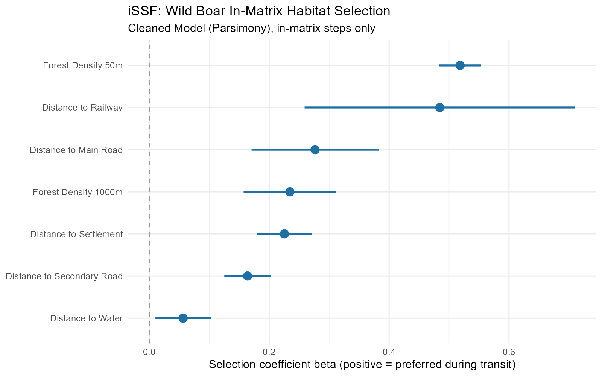

# Results

Two primary deliverables were created during this project: a 25-metre resolution wild boar resistance surface covering Canton Aargau (used for model calibration) and Canton Zürich (produced by parameter transfer), and the *Wildboar Connectivity (ASF)* QGIS plugin that uses this resistance surface as its analytical input. The following sections present the results of these two steps.

```{r}
#| label: setup
#| include: false

# Flush any HTML widget dependencies left over from a previous render pass
# of this same document (e.g. the HTML pass), so the typst pass starts from
# a clean slate and isn't flagged for HTML output it never produced itself.
invisible(knitr::knit_meta(class = NULL, clean = TRUE))

# ── Project paths ──────────────────────────────────────────────────────────
project_root <- ".."
data_temp    <- file.path(project_root, "data/temp")
data_proc    <- file.path(project_root, "data/processed")
data_raw     <- file.path(project_root, "data/raw")

# ── Packages ───────────────────────────────────────────────────────────────
options(repos = c(CRAN = "https://cloud.r-project.org"))
pkgs <- c("terra", "ggplot2", "dplyr", "knitr", "kableExtra",
          "patchwork", "scales", "leaflet", "raster")
for (p in pkgs) {
  if (!requireNamespace(p, quietly = TRUE)) install.packages(p)
  suppressPackageStartupMessages(library(p, character.only = TRUE))
}

# ── Global knitr options ───────────────────────────────────────────────────
knitr::opts_chunk$set(
  echo    = FALSE,
  warning = FALSE,
  message = FALSE,
  dpi     = 96
)
terraOptions(progress = 0)  # suppress progress bars

# ── Helper functions ───────────────────────────────────────────────────────

# Load a raster and aggregate for display
disp <- function(path, fact = 5, fun = "mean") {
  r <- rast(path)
  if (fact > 1) aggregate(r, fact = fact, fun = fun, na.rm = TRUE) else r
}

# Load a binary raster, aggregate with modal, set 0 to NA for display
disp_binary <- function(path, fact = 5) {
  r <- rast(path)
  r_agg <- if (fact > 1) aggregate(r, fact = fact, fun = "modal", na.rm = TRUE) else r
  r_agg[r_agg[] == 0] <- NA
  r_agg
}

# Compute summary statistics for a terra SpatRaster
raster_stats <- function(r, label = "") {
  v <- values(r, mat = FALSE, na.rm = TRUE)
  if (length(v) == 0) return(NULL)
  total <- prod(dim(r)[1:2])
  data.frame(
    Canton        = label,
    `Min`         = round(min(v), 3),
    `Mean`        = round(mean(v), 3),
    `Median`      = round(median(v), 3),
    `SD`          = round(sd(v), 3),
    `P10`         = round(quantile(v, 0.10), 3),
    `P90`         = round(quantile(v, 0.90), 3),
    `Max`         = round(max(v), 3),
    `Valid cells` = format(length(v), big.mark = ","),
    `NoData (%)`  = round(100 * (total - length(v)) / total, 1),
    check.names   = FALSE
  )
}

# Load the full 14-band Aargau covariate stack once
stk <- rast(file.path(data_temp, "covariate_stack.tif"))
names(stk) <- c("forest", "forest_density", "forest_density_g",
                "dist_forest_edge", "slope", "tri",
                "dist_flowing", "dist_lakes", "dist_water",
                "dist_fenced_road", "dist_main_road",
                "dist_secondary_road", "dist_settlement", "dist_railway")

# Final habitat suitability and resistance rasters (Aargau and Zürich), needed
# by both the interactive viewer (HTML) and the static maps (PDF)
r_suit_ag <- rast(file.path(data_proc, "Habitat_Suitability_Wildboar_Aargau.tif"))
r_res_ag  <- rast(file.path(data_proc, "Resistance_Keeley_Wildboar_Aargau_25m.tif"))
r_suit_zh <- rast(file.path(data_proc, "Habitat_Suitability_Wildboar_Zurich_25m.tif"))
r_res_zh  <- rast(file.path(data_proc, "Resistance_Keeley_Wildboar_Zurich_25m.tif"))
```

## Resistance Surface

In the following section the results of creating the resistance surface are shown and explained in detail.

### Telemetry Quality and Step Classification

Raw GPS telemetry data from 16 wild boar tracked in Canton Aargau between 2014 and 2017 were processed prior to trajectory analysis. Individuals with a tracking duration of less than 30 days or fewer than 100 total fixes were excluded from the dataset (n = 2). For the remaining 14 individuals (yielding 161,275 raw fixes), the trajectories were resampled to standardise the sampling frequency. A nominal 15-minute fix interval with a 5-minute tolerance was applied. Fixes that fell outside this 10 to 20-minute window, or redundant fixes within the same window, were dropped. This regularisation resulted in a 14.3% data loss (23,015 excluded fixes). Additionally, three biologically unrealistic step lengths (\>3000m) were also dropped. The remaining 138,260 standardised fixes were subsequently converted into steps, yielding a final dataset of 133,109 continuous steps for analysis.

The three-rule hierarchical classifier partitioned these steps into 7,824 (5.9%) in-matrix transit steps and 125,285 (94.1%) in-patch resting steps. Among in-matrix steps, Rule 1 (step length greater than 250 metres) captured 4,759 steps (60.8% of all in-matrix steps), Rule 2 (step length greater than 150 metres and absolute turning angle below π/4 radians) contributed 2,748 steps (35.1%), and Rule 3 (three or more consecutive directional steps each exceeding 100 metres) added 317 steps (4.1%). The in-matrix dataset served as the sole analytical sample for iSSF fitting. In-patch steps were excluded from the model because they describe resting and foraging behaviour within habitat patches rather than landscape-level transit between patches, and combining the two behavioural states would confound the resistance surface.

```{r}
#| label: tbl-classification
#| tbl-cap: "Step classification counts for the in-matrix telemetry dataset. Rules are applied hierarchically in the order shown. A step is classified as in-matrix if it meets any rule that has not been met by a prior rule."
#| tbl-colwidths: [20, 45, 17, 18]

rule_df <- data.frame(
  Rule = c("Rule 1", "Rule 2", "Rule 3", "**In-matrix**", "*In-patch*"),
  Criterion = c(
    "Step length > 250 m",
    "Step length > 150 m AND turning angle < π/4",
    "≥ 3 consecutive steps: length > 100 m AND turning angle < π/4",
    "**—**",
    "*All remaining steps (conservative default)*"
  ),
  `Steps (n)` = c("4759", "2748", "317", "**7824**", "*125285*"),
  `In-matrix (%)` = c("60.8", "35.1", "4.1", "**100.0**", "*—*"),
  check.names = FALSE
)

# Plain pandoc-native markdown table: converts cleanly to both HTML and typst
# output without depending on kableExtra's format detection
knitr::kable(rule_df, align = c("l", "l", "r", "r"), format = "pipe")
```

```{r}
#| label: fig-step-distributions
#| fig-cap: "Movement statistics of wild boar steps used for iSSF fitting. **Top Row (In-matrix):** Distribution of step lengths (left) and turning angles (right) during transit. **Bottom Row (In-patch):** Distribution of step lengths (left) and turning angles (right) during resident/foraging behavior. Vertical lines on the step length plots mark the classification thresholds at 100 m, 150 m, and 250 m used by Rules 3, 2, and 1. Dashed vertical lines on the turning angle plots mark -π/4 and π/4 radians. Symmetric, unimodal distributions near zero in turning angles indicate directional persistence."
#| fig-width: 11
#| fig-height: 8.4

# Load both datasets
df_in    <- read.csv(file.path(data_proc, "WildBoar_InMatrix_Steps.csv"))
df_patch <- read.csv(file.path(data_proc, "WildBoar_InPatch_Steps.csv"))

# === TOP ROW: IN-MATRIX PLOTS ===

p_sl_in <- ggplot(df_in, aes(x = sl_)) +
  geom_histogram(aes(y = after_stat(density)), bins = 60,
                 fill = "#2d6a4f", colour = "white", alpha = 0.85) +
  geom_vline(xintercept = c(100, 150, 250),
             linetype = c("dotted", "dashed", "solid"),
             colour   = c("#e9c46a", "#f4a261", "#e76f51"),
             linewidth = 0.8) +
  scale_x_continuous(labels = scales::comma, limits = c(0, 1500)) +
  labs(x = "Step length (m)", y = "Density",
       title = "In-matrix step lengths") +
  theme_bw(base_size = 11) +
  theme(plot.title = element_text(size = 11))

p_ta_in <- ggplot(df_in, aes(x = ta_)) +
  geom_histogram(bins = 60, fill = "#457b9d", colour = "white", alpha = 0.85) +
  scale_x_continuous(
    breaks = c(-pi, -pi/2, 0, pi/2, pi),
    labels = c("-π", "-π/2", "0", "π/2", "π")
  ) +
  geom_vline(xintercept = c(-pi/4, pi/4),
             linetype = "dashed", colour = "#e76f51", linewidth = 0.7) +
  labs(x = "Turning angle (radians)", y = "Count",
       title = "In-matrix turning angles") +
  theme_bw(base_size = 11) +
  theme(plot.title = element_text(size = 11))

# === BOTTOM ROW: IN-PATCH PLOTS ===

p_sl_patch <- ggplot(df_patch, aes(x = sl_)) +
  geom_histogram(aes(y = after_stat(density)), bins = 60,
                 fill = "#2d6a4f", colour = "white", alpha = 0.85) +
  geom_vline(xintercept = c(100, 150, 250),
             linetype = c("dotted", "dashed", "solid"),
             colour   = c("#e9c46a", "#f4a261", "#e76f51"),
             linewidth = 0.8) +
  scale_x_continuous(labels = scales::comma, limits = c(0, 1500)) +
  labs(x = "Step length (m)", y = "Density",
       title = "In-patch step lengths") +
  theme_bw(base_size = 11) +
  theme(plot.title = element_text(size = 11))

p_ta_patch <- ggplot(df_patch, aes(x = ta_)) +
  geom_histogram(bins = 60, fill = "#457b9d", colour = "white", alpha = 0.85) +
  scale_x_continuous(
    breaks = c(-pi, -pi/2, 0, pi/2, pi),
    labels = c("-π", "-π/2", "0", "π/2", "π")
  ) +
  geom_vline(xintercept = c(-pi/4, pi/4),
             linetype = "dashed", colour = "#e76f51", linewidth = 0.7) +
  labs(x = "Turning angle (radians)", y = "Count",
       title = "In-patch turning angles") +
  theme_bw(base_size = 11) +
  theme(plot.title = element_text(size = 11))

# === COMBINE PLOTS ===
(p_sl_in + p_ta_in) / (p_sl_patch + p_ta_patch)
```

### Intermediate Spatial Covariate Layers and iSSF Fitting

Fourteen spatial covariates were assembled on the 25-metre Aargau grid before VIF testing. For all distance rasters, values are in metres measured as Euclidean distance to the nearest cell of the target feature class. For all density and suitability rasters, values range from 0 to 1. Binary barrier and passage rasters contain value 1 where the feature is present and are stored as NoData elsewhere.

Seven statistically significant covariates were retained for the iSSF Fitting. They are all positive and their confidence intervals exclude zero. Forest density at the 50-metre scale and distance to railway show the highest beta coefficients with similar point estimates, but the railway coefficient carries a markedly wider interval. Distance to water shows the weakest effect, though it remains statistically significant.

{#fig-issf-coefficients}

:::: {.content-visible when-format="html"}
## Interactive Raster Viewer

The following tabbed maps allow interactive exploration of every spatial layer produced by the resistance surface pipeline. All rasters are displayed over a swisstopo Swissimage basemap. Layers within each tab can be toggled on and off using the layer control panel (top-right corner of each map). Rasters are displayed at approximately 200-metre resolution to keep the HTML document size manageable.

```{r}
#| label: leaflet-setup
#| include: false
#| eval: !expr knitr::is_html_output()

# Aggregation factor for leaflet display (~200m from 25m source)
LF <- 8

# Helper: aggregate raster, reproject to WGS84, convert to raster package object
to_leaflet <- function(r, fact = LF, fun = "mean") {
  r_sm  <- aggregate(r, fact = fact, fun = fun, na.rm = TRUE)
  r_wgs <- project(r_sm, "EPSG:4326")
  raster::raster(r_wgs)
}

# Helper: binary raster for leaflet (set 0 → NA before aggregating)
to_leaflet_bin <- function(path, fact = LF) {
  r <- rast(path)
  r[r[] == 0] <- NA
  r_sm  <- aggregate(r, fact = fact, fun = "modal", na.rm = TRUE)
  r_wgs <- project(r_sm, "EPSG:4326")
  raster::raster(r_wgs)
}

# Pre-load and prepare all layers
lf_forest      <- to_leaflet(stk[["forest"]])
lf_fd          <- to_leaflet(stk[["forest_density"]])
lf_fdg         <- to_leaflet(stk[["forest_density_g"]])
lf_dfe         <- to_leaflet(stk[["dist_forest_edge"]])
lf_slope       <- to_leaflet(stk[["slope"]])
lf_tri         <- to_leaflet(stk[["tri"]])
lf_dw          <- to_leaflet(stk[["dist_water"]])
lf_dfl         <- to_leaflet(stk[["dist_flowing"]])
lf_dlk         <- to_leaflet(stk[["dist_lakes"]])
lf_dmr         <- to_leaflet(stk[["dist_main_road"]])
lf_dsr         <- to_leaflet(stk[["dist_secondary_road"]])
lf_dra         <- to_leaflet(stk[["dist_railway"]])
lf_dse         <- to_leaflet(stk[["dist_settlement"]])
lf_dfr         <- to_leaflet(stk[["dist_fenced_road"]])
lf_hw          <- to_leaflet_bin(file.path(data_temp, "highway.tif"))
lf_ll          <- to_leaflet(rast(file.path(data_temp, "large_lakes.tif")))
lf_pa          <- to_leaflet_bin(file.path(data_temp, "passages.tif"))
lf_suit_ag     <- to_leaflet(r_suit_ag)
lf_res_ag      <- to_leaflet(r_res_ag)

# Zürich layers
lf_fd_zh       <- to_leaflet(rast(file.path(data_temp, "forest_density_zurich.tif")))
lf_fdg_zh      <- to_leaflet(rast(file.path(data_temp, "forest_density_g_zurich.tif")))
lf_dw_zh       <- to_leaflet(rast(file.path(data_temp, "dist_water_zurich.tif")))
lf_dmr_zh      <- to_leaflet(rast(file.path(data_temp, "dist_main_road_zurich.tif")))
lf_dsr_zh      <- to_leaflet(rast(file.path(data_temp, "dist_secondary_road_zurich.tif")))
lf_dra_zh      <- to_leaflet(rast(file.path(data_temp, "dist_railway_zurich.tif")))
lf_dse_zh      <- to_leaflet(rast(file.path(data_temp, "dist_settlement_zurich.tif")))
lf_hw_zh       <- to_leaflet_bin(file.path(data_temp, "highway_zurich.tif"))
lf_ll_zh       <- to_leaflet(rast(file.path(data_temp, "large_lakes_zurich.tif")))
lf_pa_zh       <- to_leaflet_bin(file.path(data_temp, "passages_zurich.tif"))
lf_suit_zh     <- to_leaflet(r_suit_zh)
lf_res_zh      <- to_leaflet(r_res_zh)

# Colour palettes
pal_green  <- colorNumeric(hcl.colors(100, "Greens"),     domain = c(0, 1),   na.color = "transparent")
pal_blues  <- colorNumeric(hcl.colors(100, "Blues"),      domain = NULL,       na.color = "transparent")
pal_terrain<- colorNumeric(hcl.colors(100, "YlOrBr"),     domain = NULL,       na.color = "transparent")
pal_suit   <- colorNumeric(hcl.colors(100, "RdYlGn"),     domain = c(0, 1),   na.color = "transparent")
pal_res    <- colorNumeric(rev(hcl.colors(100, "RdYlGn")),domain = c(1, 55),  na.color = "transparent")

# Base tile options
base_groups <- c("Swisstopo (light)", "OpenStreetMap", "Satellite")
```

::: panel-tabset
### Final Output Rasters

```{r}
#| label: map-outputs
#| eval: !expr knitr::is_html_output()

leaflet(options = leafletOptions(minZoom = 8)) |>
  addProviderTiles("CartoDB.Positron",  group = "Swisstopo (light)") |>
  addProviderTiles("OpenStreetMap",     group = "OpenStreetMap") |>
  addProviderTiles("Esri.WorldImagery", group = "Satellite") |>
  addRasterImage(lf_suit_ag, colors = pal_suit, opacity = 0.85,
                 group = "Habitat Suitability — Aargau") |>
  addRasterImage(lf_res_ag,  colors = pal_res,  opacity = 0.85,
                 group = "Resistance — Aargau") |>
  addRasterImage(lf_suit_zh, colors = pal_suit, opacity = 0.85,
                 group = "Habitat Suitability — Zürich") |>
  addRasterImage(lf_res_zh,  colors = pal_res,  opacity = 0.85,
                 group = "Resistance — Zürich") |>
  addLayersControl(
    baseGroups    = base_groups,
    overlayGroups = c("Habitat Suitability — Aargau",
                      "Resistance — Aargau",
                      "Habitat Suitability — Zürich",
                      "Resistance — Zürich"),
    options = layersControlOptions(collapsed = FALSE)
  ) |>
  setView(lng = 8.65, lat = 47.42, zoom = 9) |>
  addLegend(pal = pal_suit, values = c(0, 1), title = "Suitability (S)",
            position = "bottomright", group = "Habitat Suitability — Aargau") |>
  addLegend(pal = pal_res, values = c(1, 55), title = "Resistance (R)",
            position = "bottomright", group = "Resistance — Aargau") |>
  addLegend(pal = pal_suit, values = c(0, 1), title = "Suitability (S)",
            position = "bottomright", group = "Habitat Suitability — Zürich") |>
  addLegend(pal = pal_res, values = c(1, 55), title = "Resistance (R)",
            position = "bottomright", group = "Resistance — Zürich") |>
  # Default view: only Resistance — Zürich (and its legend) shown.
  hideGroup(c("Habitat Suitability — Aargau",
              "Resistance — Aargau",
              "Habitat Suitability — Zürich"))
```

### Forest Covariates

```{r}
#| label: map-forest
#| eval: !expr knitr::is_html_output()

pal_dfe <- colorNumeric(hcl.colors(100, "Greens"),
                        domain = range(lf_dfe[], na.rm = TRUE), na.color = "transparent")

leaflet(options = leafletOptions(minZoom = 8)) |>
  addProviderTiles("CartoDB.Positron",   group = "Swisstopo (light)") |>
  addProviderTiles("OpenStreetMap",      group = "OpenStreetMap") |>
  addProviderTiles("Esri.WorldImagery",  group = "Satellite") |>
  addRasterImage(lf_forest, colors = colorNumeric(c("#f5f5e0","#1a5c2e"), 0:1, na.color="transparent"),
                 opacity = 0.8, group = "Forest Cover (binary) — Aargau [excluded VIF]") |>
  addRasterImage(lf_fd,  colors = pal_green, opacity = 0.8,
                 group = "Forest Density 50 m — Aargau") |>
  addRasterImage(lf_fdg, colors = pal_green, opacity = 0.8,
                 group = "Forest Density Gradient 1000 m — Aargau") |>
  addRasterImage(lf_dfe, colors = pal_dfe, opacity = 0.8,
                 group = "Dist Forest Edge — Aargau [excluded VIF]") |>
  addRasterImage(lf_fd_zh,  colors = pal_green, opacity = 0.8,
                 group = "Forest Density 50 m — Zürich") |>
  addRasterImage(lf_fdg_zh, colors = pal_green, opacity = 0.8,
                 group = "Forest Density Gradient 1000 m — Zürich") |>
  addLayersControl(
    baseGroups    = base_groups,
    overlayGroups = c("Forest Cover (binary) — Aargau [excluded VIF]",
                      "Forest Density 50 m — Aargau",
                      "Forest Density Gradient 1000 m — Aargau",
                      "Dist Forest Edge — Aargau [excluded VIF]",
                      "Forest Density 50 m — Zürich",
                      "Forest Density Gradient 1000 m — Zürich"),
    options = layersControlOptions(collapsed = FALSE)
  ) |>
  setView(lng = 8.15, lat = 47.38, zoom = 10) |>
  # One legend per layer, each tied to its group via `group =` so it appears
  # only when the corresponding layer is switched on in the layer control.
  addLegend(colors = c("#f5f5e0", "#1a5c2e"), labels = c("Non-forest", "Forest"),
            title = "Forest cover", position = "bottomright",
            group = "Forest Cover (binary) — Aargau [excluded VIF]") |>
  addLegend(pal = pal_green, values = c(0, 1), title = "Forest density 50 m (0–1)",
            position = "bottomright", group = "Forest Density 50 m — Aargau") |>
  addLegend(pal = pal_green, values = c(0, 1), title = "Forest density grad. 1000 m (0–1)",
            position = "bottomright", group = "Forest Density Gradient 1000 m — Aargau") |>
  addLegend(pal = pal_dfe, values = range(lf_dfe[], na.rm = TRUE), title = "Dist. forest edge (m)",
            position = "bottomright", group = "Dist Forest Edge — Aargau [excluded VIF]") |>
  addLegend(pal = pal_green, values = c(0, 1), title = "Forest density 50 m (0–1)",
            position = "bottomright", group = "Forest Density 50 m — Zürich") |>
  addLegend(pal = pal_green, values = c(0, 1), title = "Forest density grad. 1000 m (0–1)",
            position = "bottomright", group = "Forest Density Gradient 1000 m — Zürich") |>

  hideGroup(c("Forest Cover (binary) — Aargau [excluded VIF]",
              "Forest Density 50 m — Aargau",
              "Forest Density Gradient 1000 m — Aargau",
              "Dist Forest Edge — Aargau [excluded VIF]",
              "Forest Density 50 m — Zürich",
              "Forest Density Gradient 1000 m — Zürich"))
```

### Terrain Covariates

```{r}
#| label: map-terrain
#| eval: !expr knitr::is_html_output()

pal_sl  <- colorNumeric(hcl.colors(100, "YlOrBr"), domain = c(0, 70),   na.color = "transparent")
pal_tri <- colorNumeric(hcl.colors(100, "YlOrBr"), domain = c(0, 55),   na.color = "transparent")

leaflet(options = leafletOptions(minZoom = 8)) |>
  addProviderTiles("CartoDB.Positron",  group = "Swisstopo (light)") |>
  addProviderTiles("OpenStreetMap",     group = "OpenStreetMap") |>
  addProviderTiles("Esri.WorldImagery", group = "Satellite") |>
  addRasterImage(lf_slope, colors = pal_sl,  opacity = 0.8,
                 group = "Slope (degrees) — excluded VIF") |>
  addRasterImage(lf_tri,   colors = pal_tri, opacity = 0.8,
                 group = "TRI — excluded VIF") |>
  addLayersControl(
    baseGroups    = base_groups,
    overlayGroups = c("Slope (degrees) — excluded VIF",
                      "TRI — excluded VIF"),
    options = layersControlOptions(collapsed = FALSE)
  ) |>
  setView(lng = 8.15, lat = 47.38, zoom = 10) |>
  addLegend(pal = pal_sl, values = c(0, 70), title = "Slope (°)",
            position = "bottomright", group = "Slope (degrees) — excluded VIF") |>
  addLegend(pal = pal_tri, values = c(0, 55), title = "Terrain Ruggedness Index",
            position = "bottomright", group = "TRI — excluded VIF") |>
  # Hide every layer (and its legend) by default.
  hideGroup(c("Slope (degrees) — excluded VIF", "TRI — excluded VIF"))
```

### Water Covariates

```{r}
#| label: map-water
#| eval: !expr knitr::is_html_output()

pal_dw  <- colorNumeric(hcl.colors(100, "Blues"), domain = c(0, 3500), na.color = "transparent")
pal_dlk <- colorNumeric(hcl.colors(100, "Blues"), domain = c(0, 7200), na.color = "transparent")

leaflet(options = leafletOptions(minZoom = 8)) |>
  addProviderTiles("CartoDB.Positron",  group = "Swisstopo (light)") |>
  addProviderTiles("OpenStreetMap",     group = "OpenStreetMap") |>
  addProviderTiles("Esri.WorldImagery", group = "Satellite") |>
  addRasterImage(lf_dw,   colors = pal_dw,  opacity = 0.8,
                 group = "Dist Water — combined — Aargau [in iSSF]") |>
  addRasterImage(lf_dfl,  colors = pal_dw,  opacity = 0.8,
                 group = "Dist Flowing Water — Aargau [excluded]") |>
  addRasterImage(lf_dlk,  colors = pal_dlk, opacity = 0.8,
                 group = "Dist Lakes — Aargau [excluded]") |>
  addRasterImage(lf_dw_zh, colors = pal_dw, opacity = 0.8,
                 group = "Dist Water — combined — Zürich [in iSSF]") |>
  addLayersControl(
    baseGroups    = base_groups,
    overlayGroups = c("Dist Water — combined — Aargau [in iSSF]",
                      "Dist Flowing Water — Aargau [excluded]",
                      "Dist Lakes — Aargau [excluded]",
                      "Dist Water — combined — Zürich [in iSSF]"),
    options = layersControlOptions(collapsed = FALSE)
  ) |>
  setView(lng = 8.15, lat = 47.38, zoom = 10) |>
  addLegend(pal = pal_dw, values = c(0, 3500), title = "Dist. water (m)",
            position = "bottomright", group = "Dist Water — combined — Aargau [in iSSF]") |>
  addLegend(pal = pal_dw, values = c(0, 3500), title = "Dist. flowing water (m)",
            position = "bottomright", group = "Dist Flowing Water — Aargau [excluded]") |>
  addLegend(pal = pal_dlk, values = c(0, 7200), title = "Dist. lakes (m)",
            position = "bottomright", group = "Dist Lakes — Aargau [excluded]") |>
  addLegend(pal = pal_dw, values = c(0, 3500), title = "Dist. water (m)",
            position = "bottomright", group = "Dist Water — combined — Zürich [in iSSF]") |>
  # Hide every layer (and its legend) by default.
  hideGroup(c("Dist Water — combined — Aargau [in iSSF]",
              "Dist Flowing Water — Aargau [excluded]",
              "Dist Lakes — Aargau [excluded]",
              "Dist Water — combined — Zürich [in iSSF]"))
```

### Infrastructure Covariates

```{r}
#| label: map-infrastructure
#| eval: !expr knitr::is_html_output()

pal_mr  <- colorNumeric(hcl.colors(100, "Reds"), domain = c(0, 7100), na.color = "transparent")
pal_sr  <- colorNumeric(hcl.colors(100, "Reds"), domain = c(0, 3250), na.color = "transparent")
pal_rw  <- colorNumeric(hcl.colors(100, "Reds"), domain = c(0, 7250), na.color = "transparent")
pal_se  <- colorNumeric(hcl.colors(100, "Reds"), domain = c(0, 7000), na.color = "transparent")
pal_fr  <- colorNumeric(hcl.colors(100, "Reds"), domain = c(0,16710), na.color = "transparent")

leaflet(options = leafletOptions(minZoom = 8)) |>
  addProviderTiles("CartoDB.Positron",  group = "Swisstopo (light)") |>
  addProviderTiles("OpenStreetMap",     group = "OpenStreetMap") |>
  addProviderTiles("Esri.WorldImagery", group = "Satellite") |>
  addRasterImage(lf_dmr,  colors = pal_mr,  opacity = 0.8,
                 group = "Dist Main Road — Aargau") |>
  addRasterImage(lf_dsr,  colors = pal_sr,  opacity = 0.8,
                 group = "Dist Secondary Road — Aargau") |>
  addRasterImage(lf_dra,  colors = pal_rw,  opacity = 0.8,
                 group = "Dist Railway — Aargau") |>
  addRasterImage(lf_dse,  colors = pal_se,  opacity = 0.8,
                 group = "Dist Settlement — Aargau") |>
  addRasterImage(lf_dfr,  colors = pal_fr,  opacity = 0.8,
                 group = "Dist Fenced Road — Aargau [excluded]") |>
  addRasterImage(lf_dmr_zh, colors = pal_mr, opacity = 0.8,
                 group = "Dist Main Road — Zürich") |>
  addRasterImage(lf_dsr_zh, colors = pal_sr, opacity = 0.8,
                 group = "Dist Secondary Road — Zürich") |>
  addRasterImage(lf_dra_zh, colors = pal_rw, opacity = 0.8,
                 group = "Dist Railway — Zürich") |>
  addRasterImage(lf_dse_zh, colors = pal_se, opacity = 0.8,
                 group = "Dist Settlement — Zürich") |>
  addLayersControl(
    baseGroups    = base_groups,
    overlayGroups = c("Dist Main Road — Aargau",
                      "Dist Secondary Road — Aargau",
                      "Dist Railway — Aargau",
                      "Dist Settlement — Aargau",
                      "Dist Fenced Road — Aargau [excluded]",
                      "Dist Main Road — Zürich",
                      "Dist Secondary Road — Zürich",
                      "Dist Railway — Zürich",
                      "Dist Settlement — Zürich"),
    options = layersControlOptions(collapsed = FALSE)
  ) |>
  setView(lng = 8.15, lat = 47.38, zoom = 10) |>
  addLegend(pal = pal_mr, values = c(0, 7100), title = "Dist. main road (m)",
            position = "bottomright", group = "Dist Main Road — Aargau") |>
  addLegend(pal = pal_sr, values = c(0, 3250), title = "Dist. secondary road (m)",
            position = "bottomright", group = "Dist Secondary Road — Aargau") |>
  addLegend(pal = pal_rw, values = c(0, 7250), title = "Dist. railway (m)",
            position = "bottomright", group = "Dist Railway — Aargau") |>
  addLegend(pal = pal_se, values = c(0, 7000), title = "Dist. settlement (m)",
            position = "bottomright", group = "Dist Settlement — Aargau") |>
  addLegend(pal = pal_fr, values = c(0, 16710), title = "Dist. fenced road (m)",
            position = "bottomright", group = "Dist Fenced Road — Aargau [excluded]") |>
  addLegend(pal = pal_mr, values = c(0, 7100), title = "Dist. main road (m)",
            position = "bottomright", group = "Dist Main Road — Zürich") |>
  addLegend(pal = pal_sr, values = c(0, 3250), title = "Dist. secondary road (m)",
            position = "bottomright", group = "Dist Secondary Road — Zürich") |>
  addLegend(pal = pal_rw, values = c(0, 7250), title = "Dist. railway (m)",
            position = "bottomright", group = "Dist Railway — Zürich") |>
  addLegend(pal = pal_se, values = c(0, 7000), title = "Dist. settlement (m)",
            position = "bottomright", group = "Dist Settlement — Zürich") |>
  # Hide every layer (and its legend) by default.
  hideGroup(c("Dist Main Road — Aargau",
              "Dist Secondary Road — Aargau",
              "Dist Railway — Aargau",
              "Dist Settlement — Aargau",
              "Dist Fenced Road — Aargau [excluded]",
              "Dist Main Road — Zürich",
              "Dist Secondary Road — Zürich",
              "Dist Railway — Zürich",
              "Dist Settlement — Zürich"))
```

### Barrier and Passage Layers

```{r}
#| label: map-barriers
#| eval: !expr knitr::is_html_output()

pal_bin_red   <- colorFactor(c("#e74c3c"), domain = 1, na.color = "transparent")
pal_bin_blue  <- colorFactor(c("#2980b9"), domain = 1, na.color = "transparent")
pal_bin_orange<- colorFactor(c("#e67e22"), domain = 1, na.color = "transparent")
pal_bin_green <- colorFactor(c("#27ae60"), domain = 1, na.color = "transparent")

leaflet(options = leafletOptions(minZoom = 8)) |>
  addProviderTiles("CartoDB.Positron",  group = "Swisstopo (light)") |>
  addProviderTiles("OpenStreetMap",     group = "OpenStreetMap") |>
  addProviderTiles("Esri.WorldImagery", group = "Satellite") |>
  addRasterImage(lf_hw,   colors = pal_bin_red,    opacity = 0.9,
                 group = "Highway barriers — Aargau") |>
  addRasterImage(lf_ll,   colors = pal_bin_blue,   opacity = 0.9,
                 group = "Large lakes — Aargau") |>
  addRasterImage(lf_pa,   colors = pal_bin_green,  opacity = 0.9,
                 group = "Wildlife passages — Aargau") |>
  addRasterImage(lf_hw_zh,  colors = pal_bin_red,    opacity = 0.9,
                 group = "Highway barriers — Zürich") |>
  addRasterImage(lf_ll_zh,  colors = pal_bin_blue,   opacity = 0.9,
                 group = "Large lakes — Zürich") |>
  addRasterImage(lf_pa_zh,  colors = pal_bin_green,  opacity = 0.9,
                 group = "Wildlife passages — Zürich") |>
  addLayersControl(
    baseGroups    = base_groups,
    overlayGroups = c("Highway barriers — Aargau",
                      "Large lakes — Aargau",
                      "Wildlife passages — Aargau",
                      "Highway barriers — Zürich",
                      "Large lakes — Zürich",
                      "Wildlife passages — Zürich"),
    options = layersControlOptions(collapsed = FALSE)
  ) |>
  setView(lng = 8.3, lat = 47.40, zoom = 9) |>
  addLegend(colors = "#e74c3c", labels = "Highway barrier", title = "Barrier / passage",
            position = "bottomright", opacity = 0.85, group = "Highway barriers — Aargau") |>
  addLegend(colors = "#2980b9", labels = "Large lake", title = "Barrier / passage",
            position = "bottomright", opacity = 0.85, group = "Large lakes — Aargau") |>
  addLegend(colors = "#27ae60", labels = "Wildlife passage", title = "Barrier / passage",
            position = "bottomright", opacity = 0.85, group = "Wildlife passages — Aargau") |>
  addLegend(colors = "#e74c3c", labels = "Highway barrier", title = "Barrier / passage",
            position = "bottomright", opacity = 0.85, group = "Highway barriers — Zürich") |>
  addLegend(colors = "#2980b9", labels = "Large lake", title = "Barrier / passage",
            position = "bottomright", opacity = 0.85, group = "Large lakes — Zürich") |>
  addLegend(colors = "#27ae60", labels = "Wildlife passage", title = "Barrier / passage",
            position = "bottomright", opacity = 0.85, group = "Wildlife passages — Zürich") |>
  # Hide every layer (and its legend) by default.
  hideGroup(c("Highway barriers — Aargau",
              "Large lakes — Aargau",
              "Wildlife passages — Aargau",
              "Highway barriers — Zürich",
              "Large lakes — Zürich",
              "Wildlife passages — Zürich"))
```
:::
::::

::: {.content-visible unless-format="html"}
The two maps below show the final products of the Resistance Surface Pipeline: the habitat suitability surface recovered from the fitted iSSF coefficients, and the resistance surface obtained from it through the Keeley transformation, for both Canton Aargau and Canton Zürich.

```{r}
#| label: fig-suitability
#| echo: false
#| fig-cap: "Final habitat suitability and resistance surfaces for Canton Aargau. Left: habitat suitability (0 to 1), with high values indicating landscape preferred during transit movement. Right: resistance under the Keeley transformation with C = 4, where low values are permeable and high values approach impassable."
local_png <- file.path("images", "suitability_resistance_maps_Aargau.png")
invisible(file.copy(file.path(data_proc, "suitability_resistance_maps_Aargau.png"), local_png, overwrite = TRUE))
knitr::include_graphics(local_png)
```

```{r}
#| label: fig-suitability-zurich
#| echo: false
#| fig-cap: "Final habitat suitability and resistance surfaces for Canton Zürich, produced by transferring the Aargau-fitted iSSF coefficients onto the Zürich landscape. Left: habitat suitability (0 to 1). Right: resistance under the Keeley transformation with C = 4."
local_png <- file.path("images", "suitability_resistance_maps_Zurich.png")
invisible(file.copy(file.path(data_proc, "suitability_resistance_maps_Zurich.png"), local_png, overwrite = TRUE))
knitr::include_graphics(local_png)
```
:::

## QGIS Plugin

The *Wildboar Connectivity (ASF)* plugin was implemented as a QGIS 3.40 extension and tested against the Zürich resistance raster with the WILMA core habitat polygons as LCP destination targets. Functional testing confirmed that all five analytical modules produced spatially coherent outputs for a range of outbreak origin locations across the canton. Three scenarios are reported here: a baseline analysis at an unmodified outbreak location in a forested area, a direct comparison of the five connectivity outputs and a scenario comparison demonstrating the effect of drawing a virtual fence and a wildlife corridor.

### Baseline Connectivity Analysis

For the baseline demonstration, the outbreak origin was placed in a forested grid cell north of the Winterthur city centre representative of a scenario in which the disease enters through a wild boar population in that region and disperses in different directions. All five outputs were enabled, with 2,000 BCRW realisations and 2,000 iSSF-IBMM agents. The analysis completed in under three minutes on a standard laptop.

The LCP corridor analysis connected the outbreak origin to the nearest reachable WILMA habitat clusters via the pre-computed Dijkstra cost grid. The graduated blue styling assigned light sky blue to distant corridors serving high cumulative resistance cost, vivid blue to intermediate connectors, and deep navy to the backbone segments shared by multiple routes and smaller cumulative resistance cost. The paths concentrated in the forested ridgelines and crossed the wildlife overpasses, consistent with the visual pattern of low-resistance cells in the Zürich resistance map.

The circuit-theory pinchpoint raster, computed using Circuitscape.jl via Julia subprocess, showed concentrated current density at the defined outbreak point and at several bottlenecks. These bottlenecks included, wildlife crossings, but also narrow forest corridors that are separated from one another by roads or railway tracks between habitat patches. These pinchpoints represent the locations where a fence intervention would produce the largest reduction in connectivity at lowest material cost.

The continuous infection-risk raster produced three discrete EFSA-aligned zones around the origin. The high-risk zone (risk above 0.50) extended approximately 2.5 to 3.5 kilometres in the least-resistant directions, consistent with its calibration to the 4-kilometre mean wild boar dispersal distance. The EFSA surveillance zone boundary (risk 0.15) was reached at cost-equivalent distances of approximately 8 to 10 kilometres through continuous forest and at shorter Euclidean distances across fragmented terrain.

The BCRW density and iSSF-IBMM contamination probability layers broadly corroborated the LCP and pinchpoint structure. The BCRW density surface showed the highest visitation counts along the same corridors identified by the Circuitscape analysis, confirming their role as preferred transit routes. The iSSF-IBMM log10-transformed contamination probability surface showed the steepest probability gradients at the forest-to-infrastructure transitions where resistance increases rapidly.

![Baseline connectivity outputs for a hypothetical ASF outbreak origin (red point) in Canton Zürich, without any landscape modifications. Top left: outbreak origin on OSM basemap. Top right: LCP corridors classed by cumulative edge strength. Centre left: infection-risk raster with EFSA zones (low, medium, high). Centre right: circuit-theory pinchpoint raster (Magma ramp). Bottom left: BCRW visitation density (n = 2,000). Bottom right: iSSF-IBMM contamination probability log10(p) (n = 2,000 agents).](images/baseline.png){#fig-plugin-baseline width="100%"}

### Comparison of the five connectivity outputs

In the following scenario the hypothetical outbreak origin was placed in a forested cell near Zürich city. The LCP corridors and IBMM probability follow the expected pattern along low-resistance forested ridgelines. However, the circuit-theory and BCRW outputs show artefacts in the urban matrix: current density and visitation counts accumulate in city areas where wild boar movement is ecologically implausible, a consequence of the finite rather than absolute resistance assigned to dense settlement cells. Similarly, the infection-risk surface extends high-risk zones into the urban core of Zürich, which overstates the realistic exposure probability in heavily built-up terrain. Both effects are acknowledged limitations of the specific connectivity models and are discussed in more detail in the discussion section.

{#fig-plugin-comparison}

### Scenario Comparison: Virtual Fence Intervention

To demonstrate the scenario comparison functionality, multiple virtual fences were drawn over the wildlife overpasses and a new wildlife overpass was built in the north of Winterthur crossing a highway. The fence was rasterized as a two-cell-wide NaN wall in the modified resistance array and the full analysis was rerun without changing the outbreak origin or any other parameter. Both runs used identical settings so that all differences in the output layers can be attributed entirely to the fence modification.

The pinchpoint raster showed a clear rerouting of current density away from the blocked corridor segments. The cumulative flow that previously concentrated at the motorway crossing was redistributed to the new overpass, building an alternative corridor. The LCP backbone similarly shifted away from the blocked crossing to the new generated one, increasing connectivity to the south. The area at risk of infection shrank asymmetrically on the side of the newly erected fences and expanded across the newly constructed wildlife overpass.

{#fig-comparison width="100%"}

The scenario comparison illustrates a main purpose of the plugin. It enables iterative exploration of management alternatives within the same GIS session. A wildlife manager can test different fence alignments, observe how each one redirects the modelled corridor network, and compare the resulting wild boar corridors and infection-risk zones, all without leaving the QGIS environment or re-running any preprocessing steps.