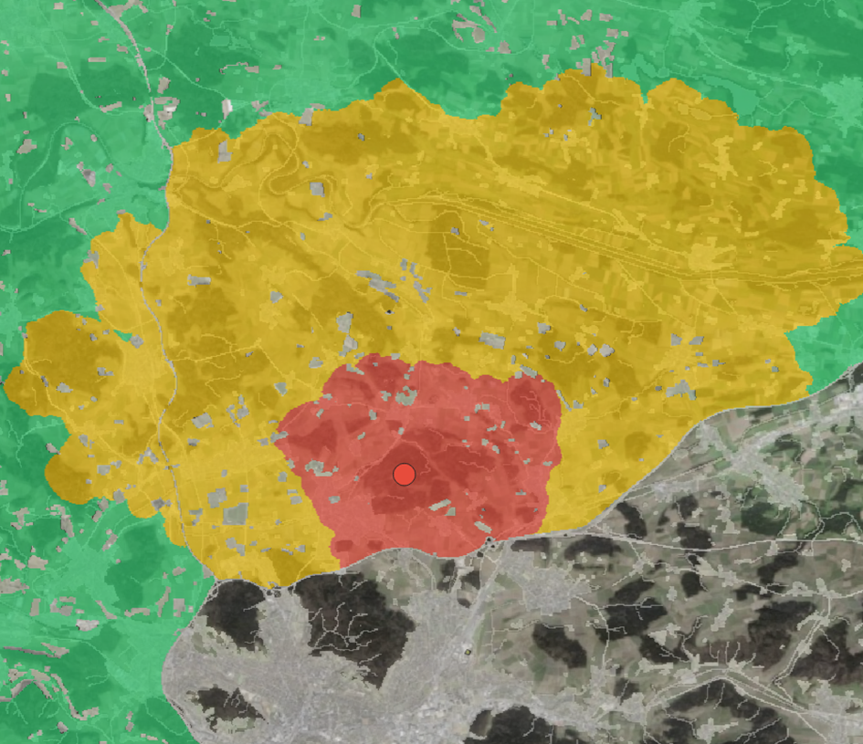
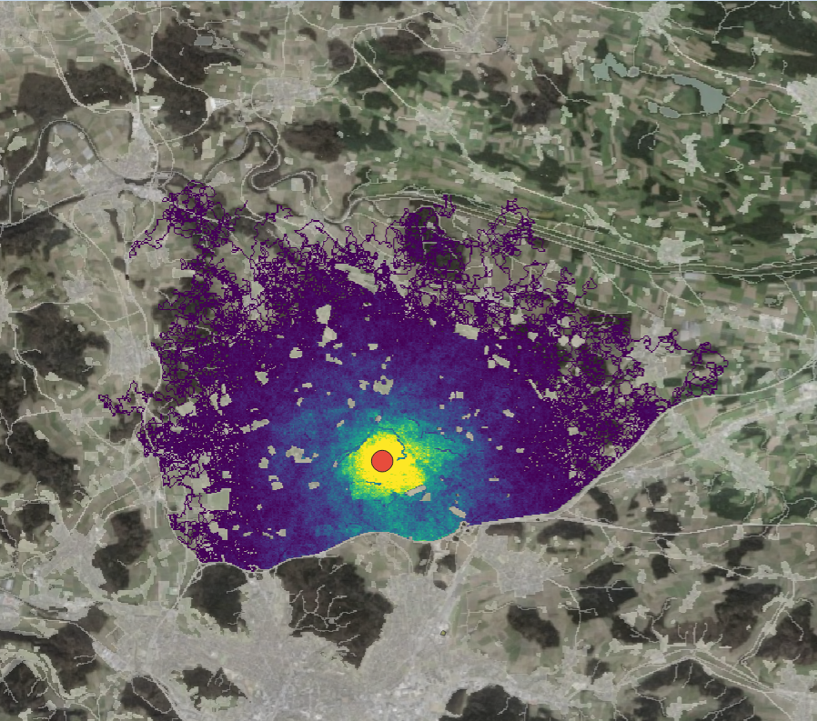
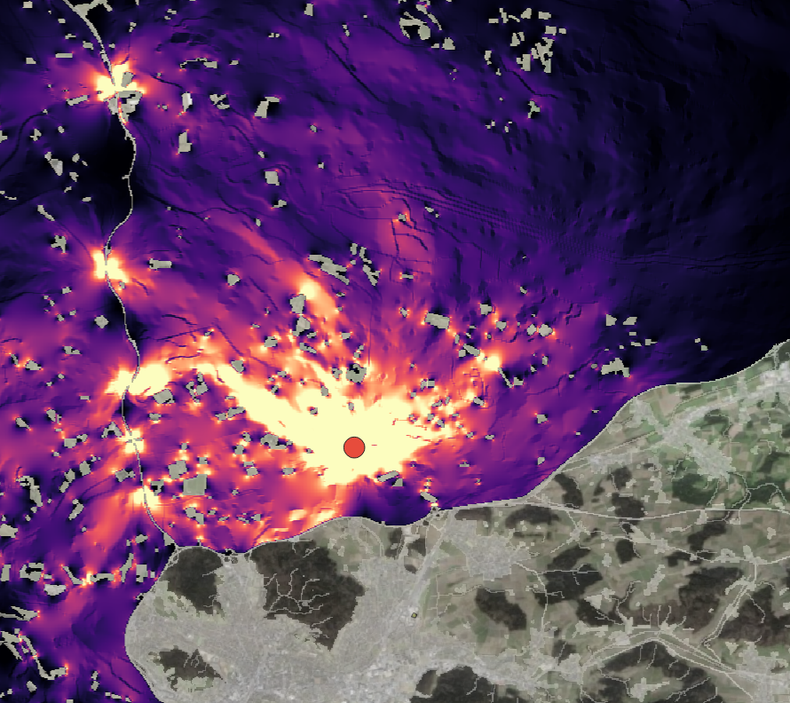
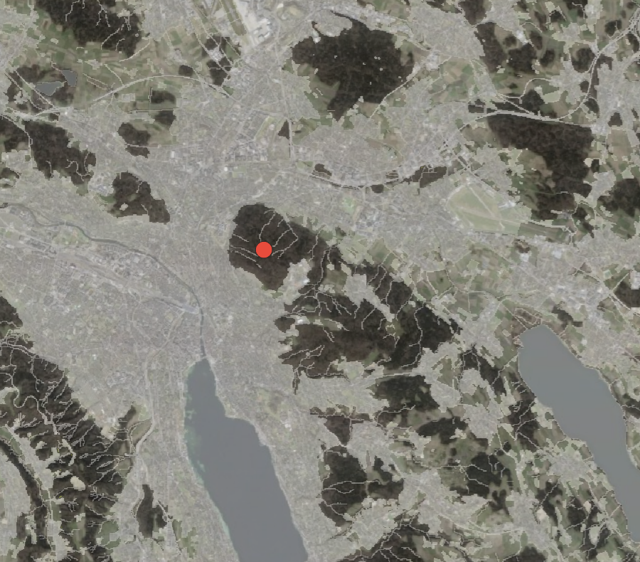
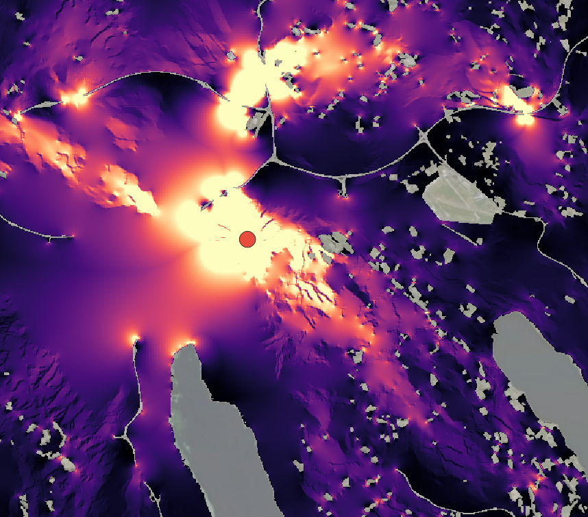
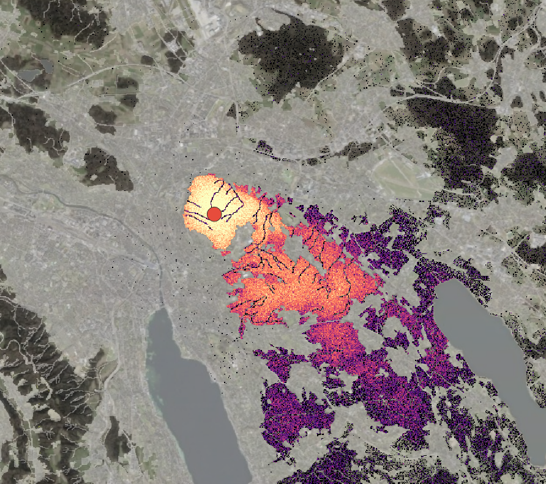
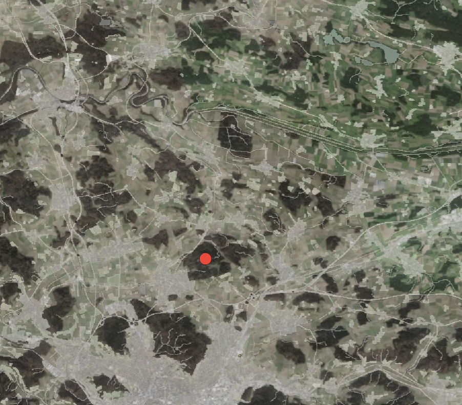

# Overview

## Progress since last update

- Bug fixes and small improvements in resistance surface generation
- QGIS Plugin:
  - fixed LCP path grid offset
  - Excluded node connections from graph
  - Infection Risk map implemented
  - Biased correlated random walk (BCRW) implemented
  - Individual-based movement model (IBMM) implemented
  - Interactive fence and overpass placing
- Major part of report written

# Resistance Surface

## Bug fixes and small improvements

- excluded unrealistic long step lengths (\>3000m)

- included variance inflation factor (VIF) check for the spatial covariantes

- excluded distance to fenced roads because animals got attracted to them (possibly because they walk beside a fenced road and search for a overpass or gap were they can cross the road).

- distance to railways has a very high avoidance.

- inclusion of absolute barriers (fenced roads, large lakes (\>1km\*\*2) and for zurich, fences.

# QGIS Plugin

## LCP fix

::::: columns
::: {.column width="50%"}
- Classified into strong, medium, and weak dispersal corridors

  according to the size and amount of endpoint habitats.

- Endpoints are either defined by an uploaded shapefile or the automatically detected 100 nearest low-resistance pixel clusters.
:::

::: {.column width="50%"}

:::
:::::

------------------------------------------------------------------------

## LCP

::::: {.columns style="font-size:0.78em"}
::: {.column width="50%"}
**Problems**

- Assumes perfect landscape knowledge — animals walk to a fixed destination; in reality they make local decisions
- Fails to show corridor width or alternative parallel routes — the entire dispersal is collapsed into one pixel-wide line
- Entirely deterministic — shows only the optimal path, not the range of routes a stressed or feverish animal might take
:::

::: {.column width="50%"}
**Benefits**

- Instantly reveals the central corridors of the landscape — easy to read for a first rough overview
- Shows the exact location where a high-resistance feature (road, fence) is crossed
- Analyses the global landscape context rather than the immediate local decision of a single animal
:::
:::::

------------------------------------------------------------------------

## Excluding node connections

Graph theory only showed nodes connected by straight lines that ignored the underlying landscape. These direct node-to-node edges carry no information about actual movement paths and were excluded. Connectivity is now represented solely by the resistance-weighted LCP, Circuitscape, BCRW, and IBMM outputs.

------------------------------------------------------------------------

## Infection Risk

A Dijkstra least-cost distance is computed from the outbreak point. Each cell's risk follows `exp(-cost / D_cost)`, calibrated to the published 4 km mean wild boar dispersal distance, mapping directly to EFSA zones: risk \> 0.50 → protection zone; 0.15–0.50 → surveillance zone.

::::: columns
::: {.column width="30%"}

:::

::: {.column width="30%"}

:::
:::::

------------------------------------------------------------------------

## Infection Risk

::::: {.columns style="font-size:0.78em"}
::: {.column width="50%"}
**Problems**

- No information about the actual corridors the animals use
- Doesn't recognize pinchpoints were infection risk is higher than normal
- Entirely deterministic: It calculates the mathematically cheapest route to every pixel
- Assumes the animal will travel according to the 4 km baseline
:::

::: {.column width="50%"}
**Benefits**

- Maps directly to EFSA protection and surveillance zone definitions
- Fast to compute by a single Dijkstra pass
- Intuitive output, easy to communicate to wildlife managers and authorities
- Adjusted to the resistance surface, settlement compresses the high risk zone, continuous forest expands it
:::
:::::

------------------------------------------------------------------------

## Biased correlated random walk (BCRW)

The animal moves step-by-step, with each step biased toward a destination and correlated with the previous direction. Resistance deflects the path, revealing which routes the animal takes when alternatives are blocked.

:::::: columns
::: {.column width="33%"}

:::

::: {.column width="33%"}

:::

::: {.column width="33%"}

:::
::::::

------------------------------------------------------------------------

## Biased correlated random walk (BCRW)

::::: {.columns style="font-size:0.78em"}
::: {.column width="50%"}
**Problems**

- Lack of Global Awareness: The BCRW agent only looks one pixel ahead and has therefore no understanding for a greater context that wild boar have
- To generate a continuous, smooth probability surface that can be easily interpreted, a massive number of walks have to be simulated which takes long processing time
- Due to the default setting of 500 walks, the resulting raster remains highly fragmented and "noisy"
- With unlimited walks it converges to the circuitscape output
:::

::: {.column width="50%"}
**Benefits**

- Captures local, step-by-step decisions shaped by the actual resistance landscape
- Shows where barriers force detours and which passages are unavoidable
- More realistic than LCP: no assumption of global landscape knowledge
:::
:::::

------------------------------------------------------------------------

## Circuitscape

The electrical resistance network reveals where movement is funnelled through narrow passages — the pinchpoints.

::::: {.columns style="font-size:0.78em"}
::: {.column width="50%"}
**Problems**

- Sensitivity to Boundary Conditions (Edge Effects) at the edge of the study area
- Does not model individual animal behaviour; it is a population-level flow model
- Parallel resistance is better than row resistance which shows that current doesn't behave exactly the same way as a wild boar (example on the next slide)
:::

::: {.column width="50%"}
**Benefits**

- Identifies pinchpoints where many corridors converge, critical locations for management interventions
- Captures the full width of a corridor and all parallel alternative routes simultaneously
- Robust to local uncertainty: small errors in resistance values do not shift the result as dramatically as in LCP
- Widely used and validated in landscape connectivity research
:::
:::::

------------------------------------------------------------------------

## Circuitscape

:::::: columns
::: {.column width="33%"}

:::

::: {.column width="33%"}

:::

::: {.column width="33%"}

:::
::::::

------------------------------------------------------------------------

## Individual-based movement model (IBMM)

Step lengths and turning angles are drawn from the iSSF β-coefficients fitted to the Aargau wild boar GPS data. Running many simulated individuals from a single outbreak point produces a contamination-probability density surface (log₁₀ scale).

::::: columns
::: {.column width="30%"}

:::

::: {.column width="30%"}

:::
:::::

------------------------------------------------------------------------

## IBMM

::::: {.columns style="font-size:0.78em"}
::: {.column width="50%"}
**Problems**

- Parameterised on Aargau data only — transferability to other regions uncertain
- No secondary transmission: an infected individual does not infect others
- No day/night behavioural differentiation
- Computationally intensive for large areas or high agent counts
- Can jump over impassable barriers like fenced roads
:::

::: {.column width="50%"}
**Benefits**

- Empirically grounded: movement kernel fitted to real Aargau wild boar telemetry
- Produces a probabilistic contamination map capturing stochastic movement variation
- Agent lifetime calibrated to the ASF infectious period (EFSA 2018)
- Output directly interpretable as carcass-finding probability per cell
- In contrast to the raster-bound BCRW that is forced to crawl pixel by pixel, the IBMM generates candidate endpoints in continuous space
:::
:::::

------------------------------------------------------------------------

## Interactive fences and overpasses

In QGIS

# Open Questions

## 1 — Is the IBMM parameterisation correct?

The IBMM uses the iSSF output β-coefficients to weight step selection at each simulation step.

::: callout-note
**Question:** Is deriving step-length and turning-angle distributions directly from the iSSF β-coefficients the correct approach, or should the movement kernel be fitted separately to the raw telemetry and the iSSF betas applied only as a habitat-selection weighting on top?
:::

------------------------------------------------------------------------

## 2 — Which connectivity models are useful?

| Model | Role | Useful for |
|------------------------|------------------------|------------------------|
| **LCP** | Deterministic least-cost route | Quick visual corridor overview |
| **Infection risk** | Static exposure surface | Defining spatial risk zones for management |
| **Circuitscape** | Current density across landscape | Identifying pinchpoints; where many individuals overlap |
| **BCRW** | Step-by-step biased walk | Showing forced routes when alternatives are blocked |
| **IBMM** | Population-level simulation | ASF contamination probability map |

::: callout-note
**Question:** Does this framing of each model's role match the expected interpretation? Is any model redundant or misleading in this context?
:::

------------------------------------------------------------------------

## 3 — Scope of the infection model

The current IBMM assumes:

- **One fixed outbreak point** — no secondary spread from infected individuals
- A single simulated population dispersing from that point
- No mechanism for one individual to infect another

::: callout-note
**Question:** Is this scope appropriate for the BA, or is at least a simple secondary-transmission step expected? Adding it would require a separate infection-state layer per individual.
:::

------------------------------------------------------------------------

## 4 — Day / night differentiation

Wild boar show strong diel activity patterns. The iSSF was fitted without separating day and night steps.

::: callout-note
**Question:** Should the IBMM (and BCRW) use separate β-coefficients for day and night movement, or is a single pooled model sufficient for the connectivity and contamination questions addressed here?
:::

------------------------------------------------------------------------

## 5 — Reproducibility requirements

Two components involve manual or semi-manual steps:

- **Resistance surface** — data sourcing (TLM3D versions, cut dates), burn-in parameter choices
- **QGIS plugin** — installation, dependency versions, tested QGIS release

::: callout-note
**Question:** What level of reproducibility is expected in the report? Full step-by-step replication guide, or method documentation sufficient for understanding and critique?
:::

# Report

## Current status

A major portion of the report has been drafted, covering:

- Background and study context
- Data and study area
- Resistance surface methodology
- Connectivity modelling framework

Methods chapter is largely complete; results and discussion sections are next.

# Next Steps

## Finalising presubmission

Presubmission document to be completed and submitted ahead of the supervisor feedback session.

## First full report draft

Writing the complete first draft results, discussion, conclusion.

## Code — minor fixes

Small remaining code issues to address in parallel:

- Edge cases in the IBMM simulation output
- Plugin polish (progress feedback, error handling)
- Resistance surface pipeline cleanup for reproducibility