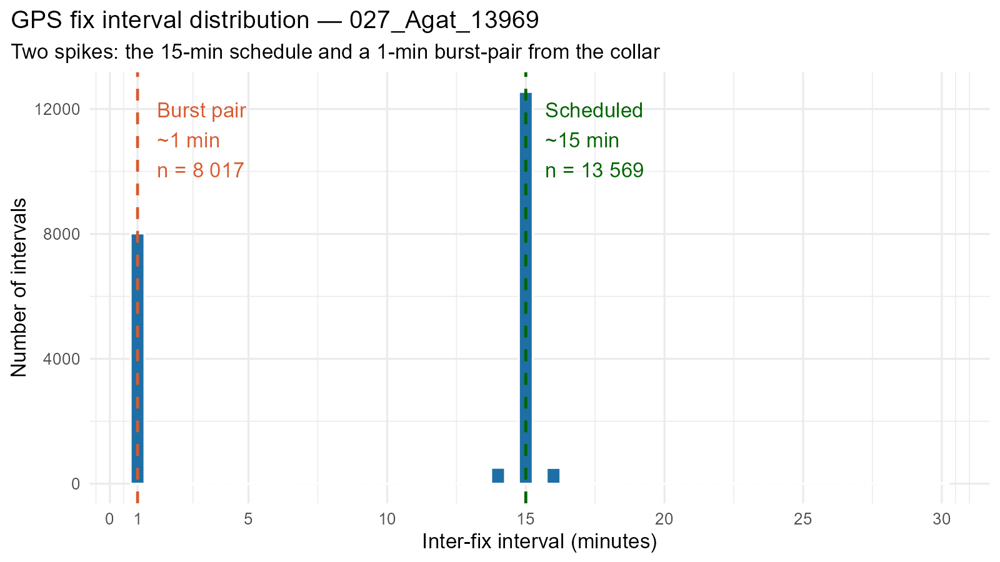
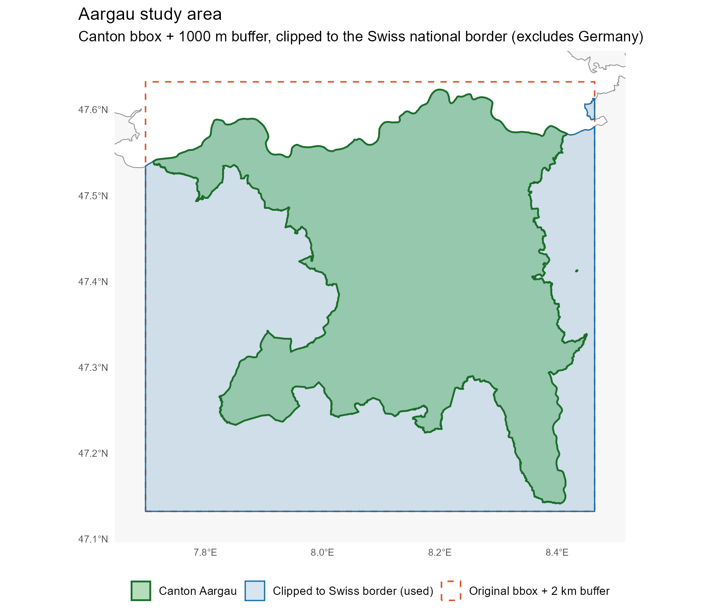

# Overview

## Progress since last update

- Telemetry resampling fixed to a clean 15-min interval
- Classification rules for *in-patch* / *in-matrix* revised
- Study area now uses a 2 km buffered rectangle around the canton
- Water layer rebuilt from the dedicated TLM3D water layers
- Infrastructure layer rewritten
- New per-class distance covariates in the iSSF
- QGIS plugin improvement
- Started writing the report

# Telemetry

## Resampling problem

Two animals (Agat, Pete) were losing \~33 % of fixes during `track_resample(rate = 15 min)`.

Diagnostic showed \~8 000 fix pairs at **exactly 1-minute intervals**, at essentially the same location.

------------------------------------------------------------------------

## Per-animal retention after fix

13 of 14 animals retain ≥ 90 % of *unique* scheduled fixes once the duplicates are collapsed.

One short re-collaring deployment (`027_Agat_13970`, 50.6 % on-schedule, 32 % short gaps) is excluded explicitly — the same animal is well covered by its other deployment.

# Step Classification

## Revised rule set

The previous "Rule 1: `sl_ = 0` → in-patch" was redundant — the default already lands such steps as in-patch. The set is now purely about identifying *in-matrix* steps reliably.

| \# | Condition | Label | Source |
|--------------|--------------------------------|--------------|--------------|
| 1 | `sl_ > 250 m` | in-matrix | Podgórski 2013 |
| 2 | `sl_ > 150 m` AND `|ta_| < π/4` | in-matrix | Clontz 2021 |
| 3 | ≥ 3 consecutive steps with `sl_ > 100 m` AND `|ta_| < π/4` | in-matrix | Benhamou 2014 |
| — | Otherwise | in-patch | Conservative default |

------------------------------------------------------------------------

## Why add Rule 3?

Rule 3 looks at **sequences of steps**, not single steps.

A run of three or more directional steps in a row is unambiguous transit and not GPS noise — even when the individual step lengths sit between 100–150 m and miss Rule 2.

Runs are evaluated per `(id, burst_)` so a gap in the GPS schedule cannot chain unrelated movements across the gap.

# Study Area

## 2 km buffered rectangle

Every raster now uses the same canonical extent: the canton bbox + 2 km, clipped to the Swiss national border.

# Water Layer

## Switched the data source

Previously: water was taken from `tlm_bb_bodenbedeckung` (`Fliessgewaesser`, `Stehende Gewaesser` classes).

Now: water comes from the dedicated layers `tlm_gewaesser_stehendes_gewaesser` and `tlm_gewaesser_fliessgewaesser`.

The dedicated layers are **more detailed and more accurate** — narrow streams that the bodenbedeckung layer collapses into the surrounding land class are preserved here.

------------------------------------------------------------------------

## Standing water — lines to solid polygons

TLM3D stores lake shorelines as **line segments** grouped by `gwl_nr`. They had to be:

1.  Unioned and merged per water body (`st_line_merge`)
2.  Cast to `POLYGON`
3.  Island polygons (`Seeinsel`) punched out with `st_difference`

Result: clean filled lake polygons with realistic islands, ready to rasterize.

------------------------------------------------------------------------

## Flowing water — `verlauf` filter

Only rivers that are objektart == "Fliessgewaesser" and are actually on the surface count as a wild-boar-relevant water feature.

`verlauf` keeps `Oberirdisch`, `Brücke`, `Wasserfall` and drops:

- `Unterirdisch` — underground pipes
- `Tunnel` — culverts
- `Vermutet` — uncertain features

Without this filter the distance-to-water raster shows phantom rivers running under cities.

# Infrastructure

## Settlement polygons, not buildings

Previously: every building footprint was rasterized → unrealistic distance to infrastructure layer.

Now: `tlm_namen_siedlungsname` (`Ort`, `Ortsteil`, `Quartier`, `Quartierteil`) polygons → continuous built-up areas that match how boar actually perceive settlements.

------------------------------------------------------------------------

## Spec-compliant road and rail loading

Two helpers run before any road / rail layer is rasterized:

- `prep_above_ground()` — drops 3D Z values, then filters out `STUFE < 0` features and any `KUNSTBAUTE` that is a tunnel / underpass / in-building
- `clean_railways()` — drops `ausser_betrieb`, plus funiculars / rack railways / museum lines

Without this, underground motorway sections and disused branch lines were appearing as solid barriers.

------------------------------------------------------------------------

## New per-class distance covariates

The single "distance to infrastructure" raster is replaced by five separate covariates:

| New covariate         | Replaces                 |
|-----------------------|--------------------------|
| `dist_fenced_road`    | part of old `dist_infra` |
| `dist_main_road`      | part of old `dist_infra` |
| `dist_secondary_road` | part of old `dist_infra` |
| `dist_settlement`     | building-distance        |
| `dist_railway`        | part of old `dist_infra` |

The iSSF can now learn a separate β for each.

------------------------------------------------------------------------

## Burn-in changed too

Secondary roads (2 m / 3 m / 4 m) are **no longer absolute barriers**. They feed the iSSF as a graded covariate but the pixels themselves are not forced to `R_max`.

Rationale: boar routinely cross forest tracks and field roads — making them impassable was over-penalising those crossings.

`r_infra` (absolute barriers) now contains only: fenced roads + main roads + railways + settlements.

# QGIS Plugin

## Region-based computation

User selects a **region of interest**, the plugin then computes:

- Least-cost paths
- Graph-based connectivity
- Circuitscape current density

…all restricted to that region.

This brought run times down to something that's actually interactive, and matches how planners ask the question in practice ("what's connectivity *here*?").

------------------------------------------------------------------------

## What didn't work

Tried letting the user pick a **start and end point** as well — the LCP part works fine that way, but Circuit Theory is fundamentally a *current-density* visualisation, not a routing one. There is no single "result" to show for a single source / destination pair under that framework.

::: callout-note
Conclusion: keep the region selection. The output is the connectivity map for that region, not a route between two points.
:::

# Challenges

## Wildlife passages — missing metadata

I wanted to weight passages by their condition.

The `Wildtierpassagen.gdb` dataset doesn't carry any such attribute.

Possible options:

- Treat all passages identically (current approach)
- Use the Wildlife Corridors as indicators if the passages are intact

# Next steps

## Report

Continue writing — methods chapter is the priority, since the pipeline has stabilised.

## QGIS Plugin

- Polish the region-selection workflow
- Check different types of lcp and circuit theory calculation methods
- Improve it with a function that the user can set his own fences and passages that alter the resistance surface.

## What's the next step?

- Different Interface options

- Modelling ASF Risk Corridors

- Integrate with the red deer model

- Meeting with Jagdverwaltung

- Presubmission (Feedback from Supervisor 05.06.2026)