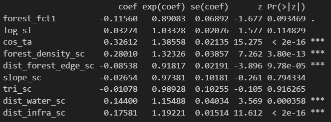
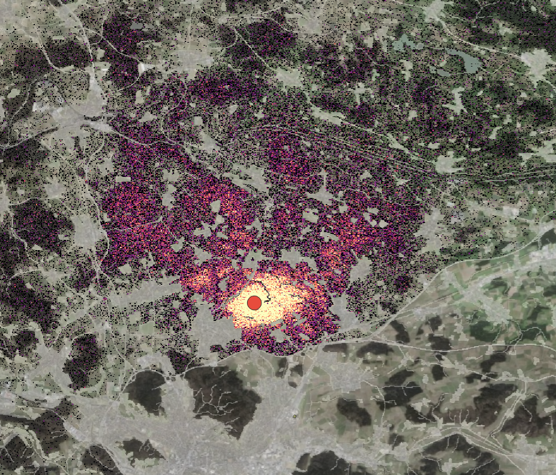
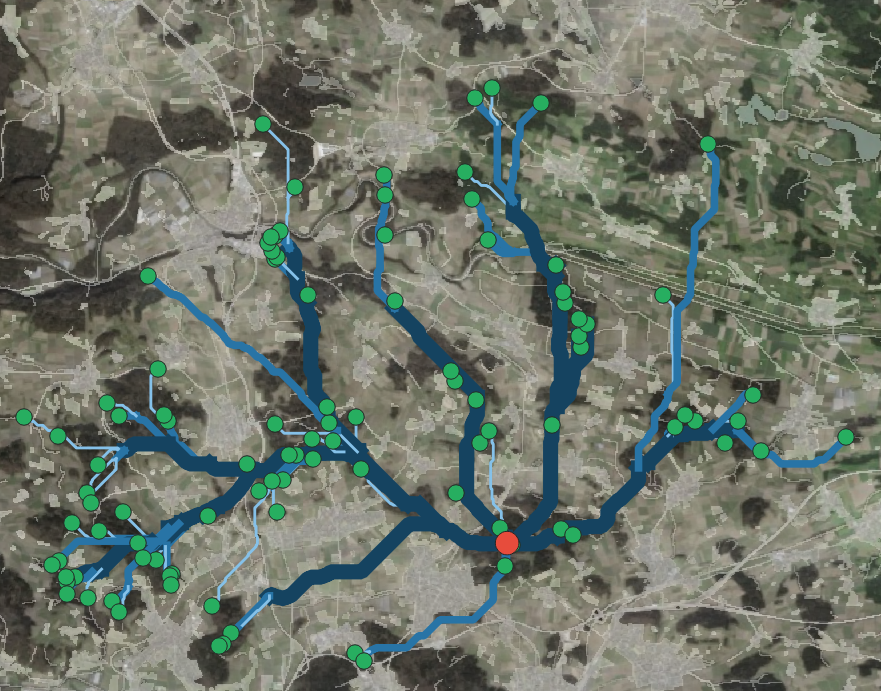

# Overview

## Progress

- Telemetry cleaned and steps classified (*in-patch* / *in-matrix*)
- Full covariate stack built for Aargau and Zürich
- iSSF fitted → resistance surface generated
- Model transferred to Zürich, including permanent fences layer
- First connectivity analysis (LCP + Circuit Theory) running
- QGIS plugin prototype started

# Step Classification

## In-patch vs. in-matrix

Wild boar move in two modes — only **in-matrix** (transit) steps inform the resistance surface.

| Mode | Signal |
|---|---|
| **In-patch** — resting, foraging | Short steps, high turning angles |
| **In-matrix** — moving between patches | Long steps, directed, fast |

---

## Difference to Red Deer Paper

:::: columns
::: {.column width="50%"}
**This pipeline**

Rule-based, thresholds from wild boar literature (Podgórski 2013, Clontz 2021, Thurfjell 2009). Conservative default towards in-patch.
:::

::: {.column width="50%"}
**Fischer et al.**

Fractal analysis → k-means clustering → Gaussian mixture model. Fully data-driven, species-agnostic.
:::
::::

::: callout-note
Wild boar don't migrate seasonally, so a short-track rule-based approach is more appropriate than a model trained to detect long-range state switches.
:::

---

**7 rules, in priority order:**

| Rule | Condition | Label |
|---|---|---|
| 1 | Speed = 0 | in-patch |
| 2 | Step ≥ 250 m | in-matrix |
| 3 | Step ≥ 150 m & turning angle < 45° | in-matrix |
| 4 | Day + inside forest + step < 50 m | in-patch |
| 5 | Night + foraging crop + step < 150 m | in-patch |
| 6 | Night + forest distance > 50 m + step ≥ 50 m | in-matrix |
| 7 | Everything else | in-patch (conservative default) |

# Covariates

## Spatial Factors

| Layer | Source | Why |
|---|---|---|
| Forest binary & density | SwissTLM3D | Resting cover  |
| Distance to forest edge | derived | Edge behaviour |
| Slope | DHM25 | Energy cost |
| Distance to water | SwissTLM3D | thermoregulation |
| Distance to infrastructure | SwissTLM3D | Avoidance |
| Highway binary | Autobahn / Autostrasse | Absolute barrier |
| Wildlife passages | Wildtierpassagen.gdb | Permeability boost |

## Zürich addition: permanent fences

Fences from the cantonal veterinary office burned in as hard barriers (R_max).

This layer has no equivalent in Fischer et al. and doesn't exist in the Aargau training data, so it had to be added manually for the transfer step.

# iSSF

## Model setup

In-matrix steps only. 10 random control steps per observed step, drawn from the empirical step-length and turning-angle distributions.

Continuous covariates are z-standardised so coefficients are directly comparable. Scaling parameters (mean, SD) are saved and reused when predicting for Zürich.

The model calculates which covariates influenced the wild boar's actual next step. Why did the wild boar choose the step it took, and why not one of the 10 random steps?

---

## Results

**Reading the coefficients:**

- β > 0 → preferred during transit → lower resistance
- β < 0 → avoided → higher resistance

---

## Difference to Red Deer Paper

:::: columns
::: {.column width="50%"}
**This pipeline**

`clogit`(Conditional Logistic Regression) stratification within each step handles individual variation implicitly.

Given the exact options available to this specific animal at this exact moment, why did it choose this path instead of the alternatives?
:::

::: {.column width="50%"}
**Fischer et al.**

GLMM with Poisson regression, random effects modelled explicitly across individuals and three regions. Necessary at national scale.
:::
::::

# Resistance Surface

## Keeley transformation

Three steps from coefficients to raster:

$$\eta = \sum_k \hat\beta_k \cdot x_k^{sc} \qquad S = \frac{\eta - \eta_{min}}{\eta_{max} - \eta_{min}} \qquad R = e^{4(1-S)}$$

R ranges from 1 (fully permeable) to ≈ 54.6 (absolute barrier). C = 4 follows Fischer et al. (2024).

---

## Transfer to Zürich

Zürich rasters are scaled with **Aargau's** means and SDs, and normalised with **Aargau's** η range. If you use Zürich's own statistics the calibration breaks and the two cantons don't connect smoothly.

**Barrier hierarchy (applied in this order):**

1. Highways → R_max
2. Open water → R_max × 0.9
3. Infrastructure pixels → R_max
4. Permanent fences → R_max *(Zürich only)*
5. Wildlife passages → R_min *(override everything above)*

---

## Connectivity

# Challenges

## National border problem

The northern edge of Zürich and Aargau borders Germany. How should I handle edge effects there?

- Fischer et al. work with Swiss data only and don't describe how they deal with this
- Take OSM data for the German side?
- What's the standard approach scientifically?

---

## QGIS plugin performance

For an interactive tool, LCP and Circuitscape need to recalculate in near real-time, which isn't realistic at full resolution.

- Is a QGIS plugin even the right format for this?
- How much do I need to downscale to make it usable?

---

# Next Steps

## Connectivity

- Reduce number of core habitat patches
- Include intercantonal corridors
- Define a scale that's scientifically sound and computationally feasible

## Tool

- Research alternatives to QGIS plugin (standalone app? web?)
- Solve the performance bottleneck
- First user-facing prototype
