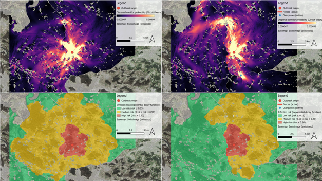
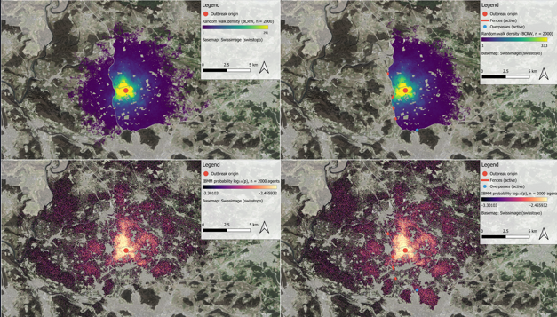

## The problem

::::: columns
::: {.column width="50%"}
::: {.r-stack}
::: {.fragment .fade-out data-fragment-index="1"}
**African Swine Fever**

- Case fatality: 90–95 % · no vaccine
- Stable in carcasses for months
- Advancing ~1–3 km/month across Europe
- Wild boar = primary reservoir
:::

::: {.fragment .fade-in data-fragment-index="1"}
**The dilemma (Hess 1994)**

> Wildlife corridors can *increase* disease spread under ASF-like conditions
:::
:::
:::

::: {.column width="50%"}

:::
:::::

::: {.notes}
Let me start with the **core tension** that motivated this thesis. 

African Swine Fever is one of the **most dangerous** livestock and **wildlife diseases** currently active in Europe. 

There is **no vaccine**, **case fatality** in wild boar approaches 100 percent, and the **virus persists in carcasses** for months. 

Since its introduction to the Caucasus in 2007, it has been **moving westward** steadily through wild boar populations.

What makes this particularly difficult from a management perspective is a **fundamental dilemma** that Hess identified in 1994.

**Under conditions of high virulence and direct-contact transmission** — which match ASF almost perfectly — a **good connectivity** with many wildlife corridors can lead to a **faster spread of the virus** and therefore to an **increased extinction risk** for populations rather than reduce it. 

This stands in **direct contrast** to the wildlife management practices for other mammals, such as the red deer.

While **high landscape connectivity** benefits red deer through **increased population exchange and genetic diversity**, for wild boar it **accelerates ASF spread**, driving increased extinction risk rather than population growth.

Every wildlife management intervention therefore **carries trade-offs** that must be evaluated carefully before implementation.

In this bachelor thesis i only focussed on the **connectivity of wild boar** and how its possible to **minimise their connectivity** to prevent ASF spreading.
:::

---

## What is missing

Existing Swiss connectivity models — Fischer (2024), Urbina (2023) — are **static**.

They answer: *where are the corridors?*

They cannot answer:

- *Which zones need surveillance if ASF is detected here today?*
- *What changes if we fence this road section?*
- *Does a new overpass help or redirect the problem?*

::: {.notes}
More specifically, the **goal** is to expand existing static connectivity models by developing an interactive QGIS plugin.

This plugin lets wildlife authorities **simulate an ASF outbreak** from any location in the canton, test the **effect of placing a barrier fence** across a pinchpoint, or **assess how a new wildlife crossing** would change movement corridors, all without programming knowledge.
:::

---

## Research objectives

**1 — Species-specific resistance surface**

Adapt the connectivity modelling framework from red deer (Fischer (2024), Urbina (2023)) to wild boar using GPS telemetry from Canton Aargau

**2 — Interactive QGIS planning tool**

Build a plugin that lets wildlife managers simulate ASF spread and test interventions

::: {.notes}
To build this plugin, an **empirical resistance surface** was first created based on GPS telemetry data from wild boars in the canton of Aargau.

The Plugin, then **takes this resistance surface** and lets the user run five different connectivity and risk analyses from a single interface, without programming knowledge.
:::

---

## Study area

::::: columns
::: {.column width="55%"}
- **Calibration:** Canton Aargau — GPS telemetry available
- **Transfer:** Canton Zürich — independent application area
- 25 m resolution · Swiss LV95
- Landscape: Swiss Mittelland — motorways, rail, agriculture interrupting forested ridges
:::

::: {.column width="45%"}

:::
:::::

::: {.notes}
Geographically, the tool was calibrated for the **Swiss Plateau** area. 

The GPS data was **collected in Canton Aargau**, and then transfered to the Canton of Zürich.

Both cantons **share a similar landscape** of a relatively flat plateau cut by motorways and several major rail lines, with forested ridges that are the main wildlife corridors.

The cantonal boundaries were **buffered** by one kilometre **to avoid edge effects** in focal window calculations near the study area margins.

The processing extent was **clipped at the national border** because the high-resolution Swiss federal geodata used for covariate derivation does not extend into Germany, and harmonising Swiss and German topographic datasets would have **exceeded the scope** of this thesis.
:::

---

## Resistance Surface Pipeline

::: {.notes}
Here you can see the **Processdiagram** of the Resistance Surface Pipeline.

It starts with **raw GPS data** from 16 animals in Aargau between 2014 and 2017 at a 15-minute fix interval. 

After **removing short deployments and dropping biologically implausible steps**  I classified each step as either in-matrix or in-patch using a three-rule hierarchical classifier. 

**Only the in-matrix** transit steps were used for fitting the iSSF, because those are the steps where **selection of movement corridors** actually happens. 

The iSSF produces **beta coefficients** that quantify which habitats animals prefer or avoid during transit. 

Those coefficients feed into the resistance surface through the **Keeley exponential transformation**.
:::

---

## Step classification

| Rule | Criterion | Steps | Share |
|------|-----------|------:|------:|
| 1 | Length > 250 m | 4,759 | 60.8 % |
| 2 | Length > 150 m **and** \|angle\| < π/4 | 2,748 | 35.1 % |
| 3 | ≥ 3 consecutive: length > 100 m **and** \|angle\| < π/4 | 317 | 4.1 % |
| — | Remaining (in-patch default) | 125,285 | — |

**Result: 7,824 in-matrix steps (5.9 %) · 14 individuals**

::: {.notes}
The classifier works **hierarchically**. 

Rule 1 catches **long, clearly directional** steps above 250 metres. 

Rule 2 catches **medium-distance** steps that are also **directionally consistent** — turning angle below π/4. 

Rule 3 catches **sustained runs** where no individual step is particularly long, but the **animal maintains direction over at least three consecutive steps**. 

Anything that fails all three rules is conservatively labelled **in-patch**.

The **thresholds are my own methodological decisions** informed by published wild boar movement data — Podgórski's speed data, Clontz's HMM results on the traveling state, and Benhamou's conceptual framework for in-patch versus in-matrix movement. None of those papers state these exact values as ready-to-use rules.

The result is that **94 percent** of steps are in-patch, which makes biological sense. Wild boar spend most of their time foraging and resting in a patch. The 6 percent that are in-matrix are the transit events the model is built on.
:::

---

## iSSF — 7 covariates retained

::::: columns
::: {.column width="50%"}
::: {style="font-size:0.82em"}
14 candidates → **7 retained** (all VIF < 1.5)

**Kept:**

- forest density 50 m
- forest density 1000 m
- distance to water
- distance to main roads
- distance to secondary roads
- distance to railways
- distance to settlements
:::
:::

::: {.column width="50%"}
::: {.callout-important}
**Fenced road exclusion**

Initial β = −0.60 → apparent attraction to motorways.

Cause: animals *pacing along* fenced motorways, not crossing them. This is a data artefact, not true preference. Fenced roads belong in the burn-in, not the regression.
:::
:::
:::::

::: {.notes}
An iSSF (**integrated step-selection function**) is a **statistical model** that estimates which habitat features an animal selects for during movement by comparing observed GPS steps to random alternative steps drawn from the animal's own movement distribution.

I started with **14 candidate covariates** from the swissTLM3D dataset and the DHM25 elevation model. After a VIF (Variance Inflation Factor) check to flag collinearity, seven survived with all VIFs below 1.5.

The most interesting exclusion is **distance to fenced roads**. In the initial exploratory model, the **coefficient** came back **negative** — apparently indicating that **wild boar are attracted to motorways**. 

That is ecologically implausible. 

What is actually happening is that an animal that cannot cross a fenced motorway **walks along the fence** for an extended distance, creating a **systematic spatial association** between the animal and the motorway in the data. **The iSSF picks this up as apparent attraction**. The correct treatment is to place fenced roads in the burn-in part as absolute barriers and leave them out of the regression.
:::

---

## iSSF results

::::: columns
::: {.column width="55%"}

:::

::: {.column width="45%"}
- All 7 coefficients **positive**
- Positive = preferred during transit
- Forest density 50 m: tightest CI — most reliably estimated
- Railway: strong avoidance, wide CI (sparse in Aargau)
- Movement kernel terms both highly significant
:::
:::::

::: {.notes}
All seven retained covariates were **positive predictors** of transit movement, confirming that **wild boar prefer** denser forest cover and greater distance from roads, railways, and settlements during directed travel. This pattern is **biologically realistic and consistent** with the established movement ecology of the species.

The forest density at the 50 metre scale has the **highest beta coefficient** and **smallest standard error**. Which means its the **most reliably estimated effect**: immediate cover is the dominant driver of where a wild boar chooses to transit through the landscape.

**Railway avoidance** has also a very strong point estimate but the **widest confidence interval**, because Aargau has relatively **few railway lines** and the training data for that covariate is sparse. The **avoidance is real**, but we should not over-interpret the precise magnitude.

The **two movement kernel** terms were **both significant**, confirming that habitat selection and movement mechanics needed to be modelled jointly.
:::

---

## Resistance surface — Aargau

{width=100%}

::: {style="font-size:0.75em; color:#555"}
Range: 1–54.6 | NoData = absolute barriers
:::

::: {.notes}
This is the **final Habitat Suitability and Resistance Surface** for the Canton Aargau.

They **reproduce the expected landscape structure**. **Forested ridges** appear as low-resistance green corridors. The **agricultural plain and urban areas push** resistance up toward the maximum. **Motorways and large lakes** appear as grey NoData — absolute barriers.

The **median resistance being above the scale midpoint** tells us that more than half the landscape is costly terrain for a transiting wild boar. 

This is consistent with what ecologists call a **landscape of fear** — animals are reluctant to cross open ground and concentrate their transit into a small fraction of the landscape.
:::

---

## Transfer to Zürich

{width=100%}

::: {style="font-size:0.75em; color:#555"}
Aargau β and z-standardisation reused | Zürich-specific normalisation for within-canton contrast | permanent ASF fences burned in as absolute barriers
:::

::: {.notes}
For the transfer to Zürich, I **reused the Aargau beta coefficients and z-standardisation** parameters unchanged. 

This **keeps the coefficients interpretable** — a unit change in a covariate still means a unit change on the Aargau scale. 

Only the **final min-max normalisation** of the linear predictor is computed on the **Zürich-specific range**, so that the full resistance scale is used within Zürich rather than being compressed.

One additional element unique to Zürich are the **permanent ASF prevention fences** from the cantonal veterinary authority. Those are **burned in as absolute barriers** alongside fenced motorways and large lakes. 

At the end the **Wildlife passages** override everything.
:::

---

## QGIS Plugin workflow

::: {.notes}
This is the **Processdiagram** of the QGIS Plugin workflow.

First the **resistance surface has to be loaded** in a QGIS session.

Then the **user picks an outbreak point** on the map with a single click. They can **optionally draw fence segments or place new wildlife overpasses**.

Those **modifications are applied to a copy of the raster in memory**, so the original file is never touched. 

Then they **select which of the five analyses** to run and press Run.

Everything happens in a **background thread** so QGIS stays responsive. All outputs appear as styled map layers within about three minutes for a typical 10-kilometre analysis window.

The **five modules are complementary**: LCP gives the backbone corridor, infection risk maps the EFSA (European Food Safety Authority) zones, Circuitscape identifies bottlenecks, BCRW provides a stochastic cross-check, and the IBMM adds an epidemiological layer calibrated to the ASF infectious period.
:::

---

## Demo — Baseline (Winterthur)

::::: columns
::: {.column width="40%"}
{width=100%}
:::

::: {.column width="60%"}
::: {style="font-size:0.72em; line-height:1.5"}
**Top left — Outbreak origin**
Placement north of Winterthur on the resistance surface on Open Street Map Basemap.

**Top right — Least-cost paths**
Corridors to nearest habitat clusters. Darker blue = higher shared movement.

**Middle left — Infection risk**
Red = high risk (3 km), yellow = surveillance zone (10 km), green = low risk.

**Middle right — Circuit theory**
Bright cells are pinchpoints where current concentrates — priority fence locations.

**Bottom left — Random walk**
Density from 2,000 simulated animals. Brightness shows movement concentration.

**Bottom right — iSSF agent model**
Contamination probability from 2,000 infected agents over the ASF infectious period.
:::
:::
:::::

::: {.notes}
This is a baseline run with the outbreak origin placed north of Winterthur.

The top-left panel shows the location on an **OpenStreetMap basemap**. The surrounding forested ridges are clearly visible, and the Winterthur urban area sits to the south.

The top-right panel shows the **least-cost path corridors**. These are the cheapest routes through the resistance surface from the origin to the nearest habitat clusters. The darker the blue, the more corridors share that segment, so it marks the main backbone the model considers most used.

The middle-left panel shows the **infection risk surface**. It is a continuous probability layer derived from cost-distance. The red area is the high-risk zone corresponding to the EFSA 3-kilometre protection radius, the yellow area is the 10-kilometre surveillance zone, and green marks low risk beyond that. The zones are not circles because the landscape resistance influences them.

The middle-right panel shows the **circuit-theory pinchpoints**. Current is injected from the origin and the brightness shows where it concentrates. The brightest cells are the structural bottlenecks: placing a fence there would have the greatest effect on connectivity.

The bottom-left panel is the **biased correlated random walk**. Two thousand simulated animals were released and their visit density was accumulated. The bright core confirms the most probable movement area around the origin.

The bottom-right panel is the **iSSF agent model**. Two thousand infected agents moved for a stochastically drawn infectious period and the fraction visiting each cell gives a contamination probability. This is the only module that combines movement with the epidemiology of ASF directly.
:::

---

## Demo — Scenario comparison

::::: columns
::: {.column width="50%"}

:::

::: {.column width="50%"}

:::
:::::

::: {.notes}
Starting from the baseline, I drew a fence segment across the main bottlenecks identified by Circuitscape at the wildlife overpasses on a motorway, and placed a new virtual overpass on a motorway directly in the north of winterthur. Left panel is baseline, right panel is after the intervention.

The primary corridor is blocked and the model routes more to the north and crosses the new overpass to the south of the outbreak point.
:::

---

## Risk and contamination — fence scenario

::::: columns
::: {.column width="50%"}

:::

::: {.column width="50%"}

:::
:::::

::: {.notes}
Here are the other analysis.

In the circuit theory panels, the fence is visible as a white line cutting through the brightest branch. Current can no longer flow through that segment, so it redistributes into secondary corridors. The overall pinchpoint pattern shifts north and southward toward the overpasses.

In the infection risk panels, the effect is asymmetric. The risk zones contract on the fenced side because the model can no longer route through that corridor. On the overpass side the zones extend, which is the expected trade-off: the fence does not eliminate connectivity, it redirects it.

The random walk panels show the same redistribution stochastically. The bright density core around the origin is now pulled toward the overpass rather than spreading evenly in all directions. The fence is working as a barrier in the simulation.

The IBMM layer shows nearly no change when the fences and overpass are included. This is due to the implementation of the IBMM method were any agent jumps more than just to its neighbouring pixel and therefore can easily jump over the motorway, which is unrealistic and not very helpful.

Therefore the key message is that no single method is best for building such a management tool but including different analysis brings best possible information to make a decision.
:::

---

## Discussion

::::: {.columns style="font-size:0.82em"}
::: {.column width="50%"}
**What worked**

- Coefficients ecologically interpretable: forest cover, infrastructure avoidance
- Resistance surface reproduces expected landscape structure
- Five modules complement each other well
- Interactivity closes the gap to operational management
:::

::: {.column width="50%"}
**Key limitations**

- No Zürich telemetry → no quantitative validation
- 10-year gap between telemetry (2014–17) and landscape data (2026)
- Keeley C = 4 from red deer, no wild-boar-specific value
- IBMM can step across absolute barriers (endpoint selection artefact)
:::
:::::

::: {.notes}
Now to the discussion.

The iSSF results are ecologically coherent. All infrastructure classes produce avoidance during transit, forest density drives the most precisely estimated effect, and the resistance surface looks like what you would expect from field knowledge of the study area.

The biggest methodological limitation is the Keeley constant. C equals 4 controls how steeply resistance rises as suitability falls. That value was calibrated by Fischer for red deer. Wild boar are more generalist and may experience the landscape as less costly — a lower C might be more appropriate, but no species-specific value exists in the literature.

On the validation side: I have no Zürich telemetry to test the transferred surface against. Model quality is assessed through visual plausibility only. That is the most important thing to fix in future work.

The IBMM has a known artefact where agents can appear on the wrong side of an absolute barrier. This happens because endpoint selection checks habitat suitability at the destination but not whether the path crosses a NaN wall.
:::

---

## Conclusions and outlook

::::: {.columns style="font-size:0.82em"}
::: {.column width="55%"}
**Deliverables**

- First wild-boar-specific resistance surface for the Swiss Mittelland
- QGIS plugin: 5 analyses · <3 min · no programming required
- Addresses the Hess (1994) trade-off in an operational planning context

**The tool is ready for pilot use**
:::

::: {.column width="45%"}
**Priority next steps**

1. GPS telemetry from Zürich wild boar — validation
2. Population density weighting
3. Day / night movement distinction
4. Better forest data (lidar / canopy height)
5. Cross-border data (German side of Rhine)
:::
:::::

::: {.notes}
To summarise: this thesis produced two concrete deliverables. 

The resistance surface is calibrated specifically for wild boar in the Swiss Plateau. 

The QGIS plugin is an interactive wildboar connectivity and ASF scenario planning tool that integrates five complementary connectivity models in a single accessible interface.

The most important next step is straightforward: get GPS tracking data from wild boar in Zürich and run a formal validation. 

Everything else on the list is valuable, but none of it matters as much as knowing whether the model actually captures how Zürich wild boar move.
:::

---

## Thank you

::: {style="text-align:center; margin-top:2em"}
**Lukas Buchmann**

Bachelor Thesis · Applied Digital Life Science · ZHAW · July 2026

Supervisors: Nils Ratnaweera · Benjamin Sigrist
:::

::: {style="text-align:center; margin-top:2.5em; font-size:0.85em; color:#555"}
*Happy to take questions.*