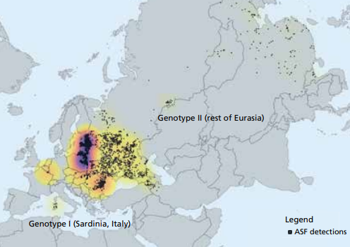
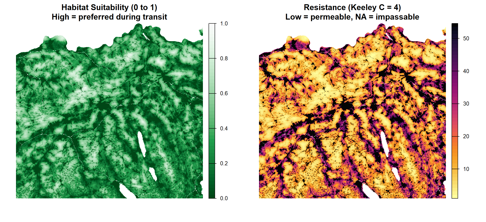
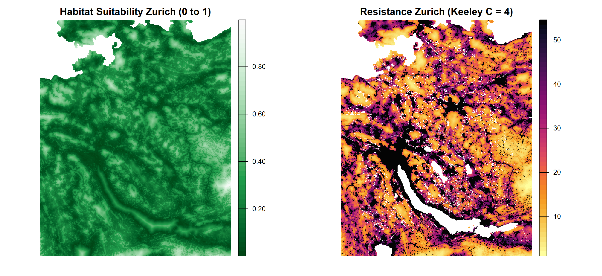
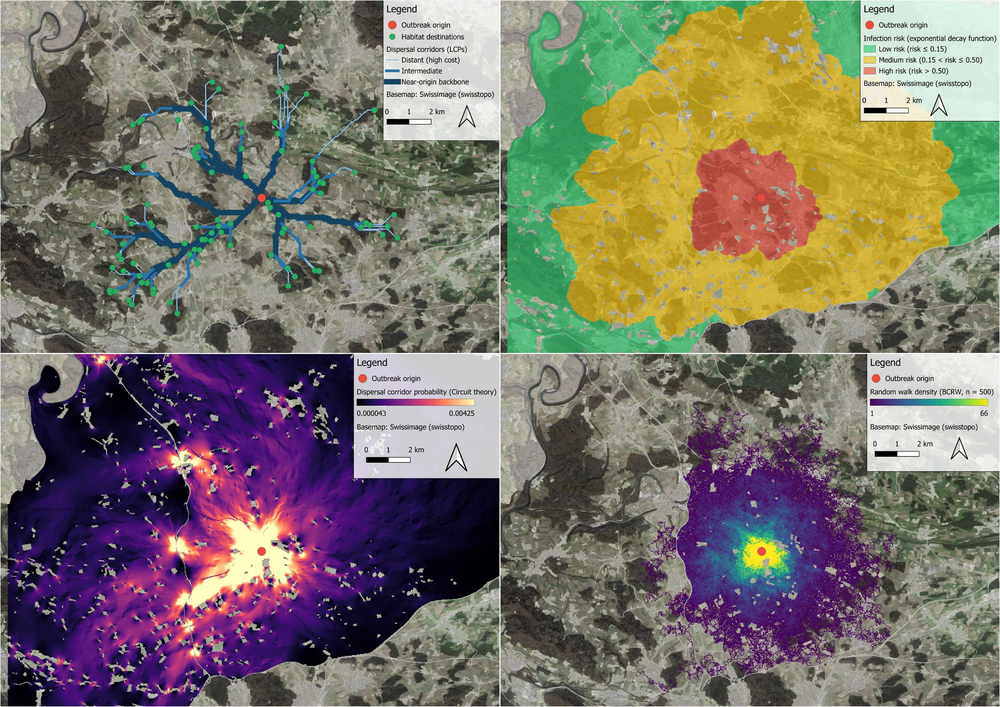
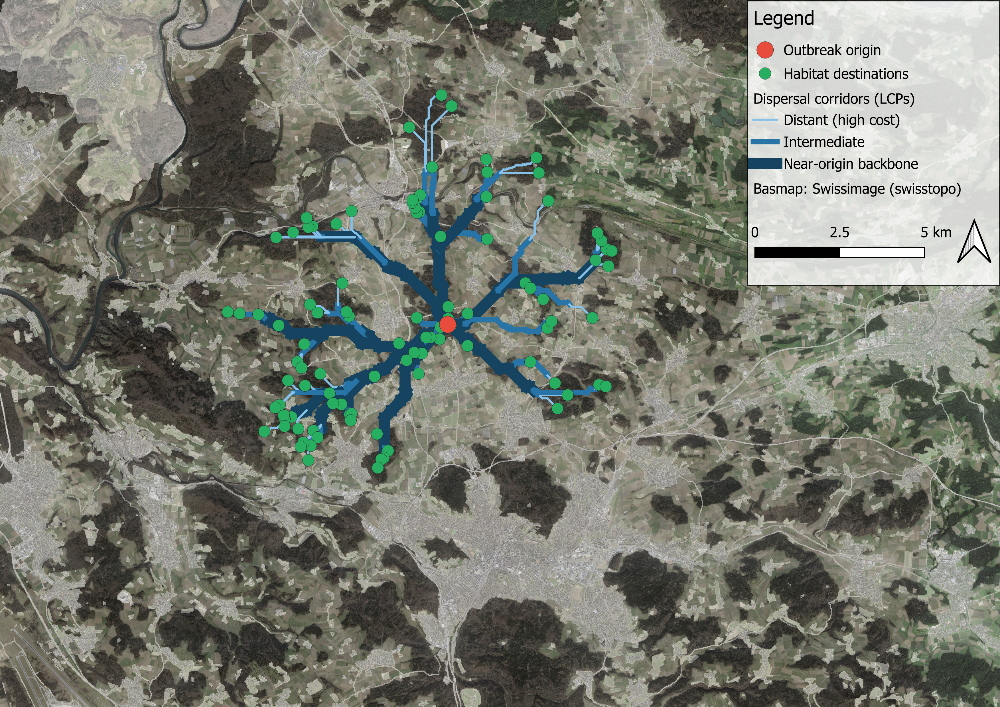
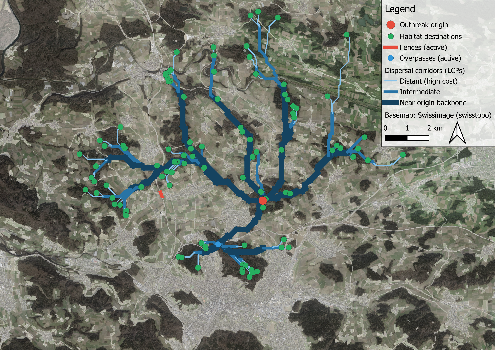
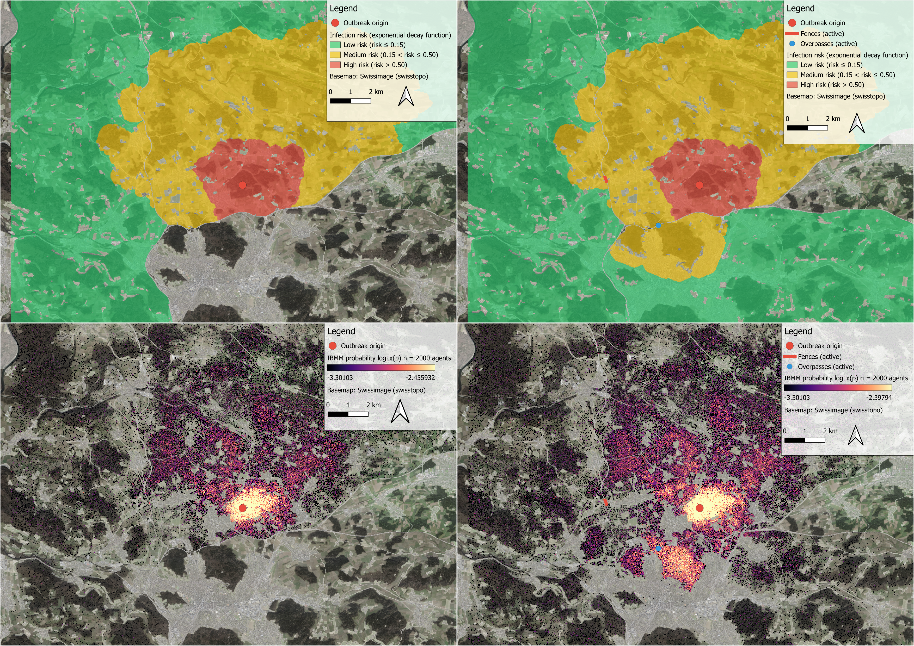

## The problem

::::: columns
::: {.column width="50%"}
::: {.r-stack}
::: {.fragment .fade-out data-fragment-index="1"}
**African Swine Fever**

- Case fatality: 90–95 % · no vaccine
- Stable in carcasses for months
- Advancing ~1–3 km/month across Europe
- Wild boar = primary reservoir
:::

::: {.fragment .fade-in data-fragment-index="1"}
**The dilemma (Hess 1994)**

> Wildlife corridors can *increase* disease spread under ASF-like conditions
:::
:::
:::

::: {.column width="50%"}

:::
:::::

::: {.notes}
Let me start with the core tension that motivated this thesis. African Swine Fever is one of the most dangerous livestock and wildlife diseases currently active in Europe. There is no vaccine, case fatality in wild boar approaches 100 percent, and the virus persists in carcasses for months. Since its introduction to the Caucasus in 2007, it has been moving westward steadily through wild boar populations.

What makes this particularly difficult from a management perspective is a fundamental dilemma that Hess identified in 1994. Under conditions of high virulence and direct-contact transmission — which match ASF almost perfectly — wildlife corridors can increase disease-driven population extinction risk rather than reduce it. The very forest connections that landscape ecologists work to protect can become pathways for a disease wave front.

So the question is not just "where are the corridors?" but "what happens to disease spread if we modify a specific one?"
:::

---

## What is missing

Existing Swiss connectivity models — Fischer (2024), Urbina (2023) — are **static**.

They answer: *where are the corridors?*

They cannot answer:

- *Which zones need surveillance if ASF is detected here today?*
- *What changes if we fence this road section?*
- *Does a new overpass help or redirect the problem?*

::: {.notes}
The gap is between excellent scientific products and operational management decisions. Fischer and Urbina produced rigorous static resistance surfaces and connectivity maps. But a veterinary officer who gets a confirmed ASF detection at six in the morning does not have time to rerun an R script. They need to pick a point on a map and immediately see which zones are at risk and whether a structural intervention would help.

That is the gap I set out to close.
:::

---

## Research objectives

**1 — Species-specific resistance surface**

Adapt the connectivity modelling framework from red deer to wild boar using GPS telemetry from Canton Aargau

**2 — Interactive QGIS planning tool**

Build a plugin that lets wildlife managers simulate ASF spread and test interventions — without programming

::: {.notes}
The thesis has two deliverables. First, a resistance surface calibrated specifically for wild boar, since the Fischer and Urbina models were built for red deer. Wild boar have different movement patterns, different infrastructure avoidance responses, and a much higher tolerance for agricultural land. The model needed to be rebuilt from scratch for this species.

Second, an interactive QGIS plugin — the Wildboar Connectivity ASF tool — that takes that resistance surface and lets any user run five different connectivity and risk analyses from a single interface in under three minutes.
:::

---

## Study area

::::: columns
::: {.column width="55%"}
- **Calibration:** Canton Aargau — GPS telemetry available
- **Transfer:** Canton Zürich — independent application area
- 25 m resolution · Swiss LV95
- Landscape: Swiss Mittelland — motorways, rail, agriculture interrupting forested ridges
:::

::: {.column width="45%"}

:::
:::::

::: {.notes}
Geographically the study sits in the Swiss Mittelland. Canton Aargau is where the GPS data was collected, so that is where the model is calibrated. Canton Zürich is then the independent transfer target — I applied the Aargau model to Zürich without any Zürich-specific telemetry, which tests whether the coefficients generalise.

The landscape is typical for this region: a relatively flat plateau cut by the A1 motorway and several major rail lines, with forested ridges running roughly east-west that are the main wildlife corridors.
:::

---

## From GPS tracks to resistance surface

```
GPS telemetry (Aargau, 2014–2017, 15 min interval)
        │
        ▼
Preprocessing  ──  exclude short deployments, drop steps > 3,000 m
        │
        ▼
Step classification  ──  in-matrix (7,824) · in-patch (125,285)
        │
        ▼
iSSF fitting  ──  7 covariates · 10 random steps each
        │
        ▼
Resistance surface  ──  R = exp(4 · (1 − S))
        │
        ▼
Transfer to Zürich  ──  same β · Zürich-local normalisation
```

::: {.notes}
The pipeline starts with raw GPS data from 16 wild boar collared in Aargau between 2014 and 2017 at a 15-minute fix interval. After preprocessing — removing short deployments, dropping biologically implausible steps above 3000 metres — I classified each step as either in-matrix or in-patch using a three-rule hierarchical classifier. Only the in-matrix transit steps go into the iSSF, because those are the steps where selection of movement corridors actually happens. The iSSF produces beta coefficients that quantify which habitats animals prefer or avoid during transit. Those coefficients feed into the resistance surface through the Keeley exponential transformation.
:::

---

## Step classification

| Rule | Criterion | Steps | Share |
|------|-----------|------:|------:|
| 1 | Length > 250 m | 4,759 | 60.8 % |
| 2 | Length > 150 m **and** \|angle\| < π/4 | 2,748 | 35.1 % |
| 3 | ≥ 3 consecutive: length > 100 m **and** \|angle\| < π/4 | 317 | 4.1 % |
| — | Remaining (in-patch default) | 125,285 | — |

**Result: 7,824 in-matrix steps (5.9 %) · 14 individuals**

::: {.notes}
The classifier works hierarchically. Rule 1 catches long, clearly directional steps above 250 metres. Rule 2 catches medium-distance steps that are also directionally consistent — turning angle below π/4. Rule 3 catches sustained runs where no individual step is particularly long, but the animal maintains direction over at least three consecutive steps. Anything that fails all three rules is conservatively labelled in-patch.

The thresholds are my own methodological decisions informed by published wild boar movement data — Podgórski's speed data, Clontz's HMM results on the traveling state, and Benhamou's conceptual framework for in-patch versus in-matrix movement. None of those papers state these exact values as ready-to-use rules.

The result is that 94 percent of steps are in-patch, which makes biological sense. Wild boar spend most of their time foraging and resting in a patch. The 6 percent that are in-matrix are the transit events the model is built on.
:::

---

## iSSF — 7 covariates retained

::::: columns
::: {.column width="50%"}
14 candidates → **7 retained** (all VIF < 1.5)

**Kept:** forest density 50 m, forest density 1000 m, distance to water, distance to main roads, secondary roads, railways, settlements

**Excluded:** slope, TRI, edge distance, forest binary, fenced road distance, flowing / lake distance separately
:::

::: {.column width="50%"}
::: {.callout-important}
**Fenced road exclusion**

Initial β = −0.60 → apparent attraction to motorways.

Cause: animals *pacing along* fenced motorways, not crossing them. This is a data artefact, not true preference. Fenced roads belong in the burn-in, not the regression.
:::
:::
:::::

::: {.notes}
I started with 14 candidate covariates from the swissTLM3D dataset and the DHM25 elevation model. After a VIF check to flag collinearity, seven survived with all VIFs below 1.5.

The most interesting exclusion is distance to fenced roads. In the initial exploratory model, the coefficient came back negative — apparently indicating that wild boar are attracted to motorways. That is ecologically implausible. What is actually happening is that an animal that cannot cross a fenced motorway walks along the fence for an extended distance, creating a systematic spatial association between the animal and the motorway in the data. The iSSF picks this up as apparent attraction. The correct treatment is to place fenced roads in the burn-in as absolute barriers and leave them out of the regression.
:::

---

## iSSF results

::::: columns
::: {.column width="55%"}

:::

::: {.column width="45%"}
- All 7 coefficients **positive**
- Positive = preferred during transit = higher resistance
- Forest density 50 m: tightest CI — most reliably estimated
- Railway: strong avoidance, wide CI (sparse in Aargau)
- Movement kernel terms both highly significant
:::
:::::

::: {.notes}
All seven retained coefficients are positive. A positive coefficient means that as the value of that variable increases, selection during transit increases — or put differently, animals prefer to move through areas with high forest density, far from infrastructure, and near water.

The forest density at the 50 metre scale has the smallest standard error. That is the most reliably estimated effect: immediate cover is the dominant driver of where a wild boar chooses to transit through the landscape.

Railway avoidance has the strongest point estimate but the widest confidence interval, because Aargau has relatively few railway lines and the training data for that covariate is sparse. The avoidance is real, but we should not over-interpret the precise magnitude.

The two movement kernel terms — log of step length and cosine of turning angle — are both strongly significant, which confirms that it is necessary to control for the movement process itself when estimating habitat selection.
:::

---

## Resistance surface — Aargau

{width=100%}

::: {style="font-size:0.75em; color:#555"}
Median resistance: 35.1 · theoretical midpoint: 27.8 · range: 1–54.6 · NoData = absolute barriers
:::

::: {.notes}
The resistance surface reproduces the expected landscape structure. Forested ridges appear as low-resistance green corridors. The agricultural plain and urban areas push resistance up toward the maximum. Motorways and large lakes appear as grey NoData — absolute barriers.

The median resistance being above the scale midpoint tells us that more than half the landscape is costly terrain for a transiting wild boar. This is consistent with what ecologists call a landscape of fear — animals are reluctant to cross open ground and concentrate their transit into a small fraction of the landscape.
:::

---

## Transfer to Zürich

{width=100%}

::: {style="font-size:0.75em; color:#555"}
Aargau β and z-standardisation reused · Zürich-specific normalisation for within-canton contrast · permanent ASF fences burned in as absolute barriers
:::

::: {.notes}
For the transfer to Zürich, I reused the Aargau beta coefficients and z-standardisation parameters unchanged. This keeps the coefficients interpretable — a unit change in a covariate still means a unit change on the Aargau scale. Only the final min-max normalisation of the linear predictor is computed on the Zürich-specific range, so that the full resistance scale is used within Zürich rather than being compressed.

One additional element unique to Zürich is the permanent ASF prevention fence network from the cantonal veterinary authority. Those are burned in as absolute barriers alongside fenced motorways and large lakes. Wildlife passages override everything.
:::

---

## QGIS Plugin — workflow

::::: columns
::: {.column width="50%"}
1. Load resistance raster
2. (Optional) upload habitat shapefile
3. Draw fences or overpasses on the map
4. Click outbreak origin
5. Select analyses · press Run
6. Styled layers appear in ~3 minutes

**No programming required**
:::

::: {.column width="50%"}
| Module | Method |
|--------|--------|
| LCP corridors | Dijkstra traceback |
| Infection risk | Cost-distance kernel |
| Circuitscape | Random walk current |
| BCRW | Von Mises biased walk |
| IBMM | iSSF-based agents |
:::
:::::

::: {.notes}
The plugin is designed so that anyone who can open QGIS and load a raster can use it. After loading the resistance surface, the user picks an outbreak point on the map with a single click. They can optionally draw fence segments or place new wildlife overpasses — those modifications are applied to a copy of the raster in memory, so the original file is never touched. Then they select which of the five analyses to run and press Run.

Everything happens in a background thread so QGIS stays responsive. All outputs appear as styled map layers within about three minutes for a typical 10-kilometre analysis window.

The five modules are complementary: LCP gives the backbone corridor, infection risk maps the EFSA zones, Circuitscape identifies bottlenecks, BCRW provides a stochastic cross-check, and the IBMM adds an epidemiological layer calibrated to the ASF infectious period.
:::

---

## Demo — Baseline (Winterthur)

{width=100%}

::: {.notes}
This is the baseline scenario with the outbreak origin placed north of Winterthur city centre. LCP corridors trace the main forest ridges running north-east and north-west. The infection risk surface shows the high-risk zone extending roughly 2.5 to 3.5 kilometres in the direction of continuous forest, compressed toward Winterthur where urban resistance is high. The EFSA surveillance zone boundary — risk threshold 0.15 — reaches about 8 to 10 kilometres through the forested corridors.

All five analyses completed in under 3 minutes. The Circuitscape pinchpoint map identifies two main bottlenecks where connectivity is strongly funnelled — those are the priority locations for any fence intervention.
:::

---

## Demo — Scenario comparison (virtual fence + overpass)

::::: columns
::: {.column width="50%"}

:::

::: {.column width="50%"}

:::
:::::

::: {style="font-size:0.8em; color:#444; margin-top:0.3em"}
Fence across principal pinchpoint · new overpass on northern corridor → LCP backbone reroutes, current density redistributes
:::

::: {.notes}
Starting from the baseline, I drew a fence segment across the main bottleneck identified by Circuitscape, and placed a new virtual overpass on the northern corridor. Left panel is baseline, right panel is after the intervention.

The primary corridor is blocked and the model routes through the overpass instead. The pinchpoint raster confirms that current density has redistributed away from the fenced segment toward secondary corridors and the new passage.

This scenario comparison happens in a single QGIS session. The user can switch between configurations without rerunning anything, which is exactly what the design aimed for.
:::

---

## Risk and contamination — fence scenario

::::: columns
::: {.column width="50%"}

:::

::: {.column width="50%"}

:::
:::::

::: {.notes}
The infection risk surface and the IBMM contamination map tell related but different stories. The infection risk is deterministic — cost-distance contours from the outbreak point. The IBMM is stochastic: 2,000 simulated agents, each with a finite lifespan drawn from the ASF infectious period distribution.

The fence has a visible asymmetric effect. The risk zone shrinks on the fenced side and extends further through the new overpass. A wildlife manager looking at this immediately sees that the fence works, but that it redirects rather than eliminates connectivity — which is the ecologically correct expectation.
:::

---

## Discussion

::::: {.columns style="font-size:0.82em"}
::: {.column width="50%"}
**What worked**

- Coefficients ecologically interpretable: forest cover, infrastructure avoidance
- Resistance surface reproduces expected landscape structure
- Five modules complement each other well
- Interactivity closes the gap to operational management
:::

::: {.column width="50%"}
**Key limitations**

- No Zürich telemetry → no quantitative validation
- 10-year gap between telemetry (2014–17) and landscape data (2026)
- Keeley C = 4 from red deer, no wild-boar-specific value
- IBMM can step across absolute barriers (endpoint selection artefact)
:::
:::::

::: {.notes}
The iSSF results are ecologically coherent. All infrastructure classes produce avoidance during transit, forest density drives the most precisely estimated effect, and the resistance surface looks like what you would expect from field knowledge of the study area.

The biggest methodological caveat is the Keeley constant. C equals 4 controls how steeply resistance rises as suitability falls. That value was calibrated by Fischer for red deer. Wild boar are more generalist and may experience the landscape as less costly — a lower C might be more appropriate, but no species-specific value exists in the literature.

On the validation side: I have no Zürich telemetry to test the transferred surface against. Model quality is assessed through visual plausibility only. That is the most important thing to fix in future work.

The IBMM has a known artefact where agents can occasionally appear on the wrong side of an absolute barrier. This happens because endpoint selection checks habitat suitability at the destination but not whether the path crosses a NaN wall. It is rare, but worth flagging.
:::

---

## Conclusions and outlook

::::: {.columns style="font-size:0.82em"}
::: {.column width="55%"}
**Deliverables**

- First wild-boar-specific resistance surface for the Swiss Mittelland
- QGIS plugin: 5 analyses · <3 min · no programming required
- Addresses the Hess (1994) trade-off in an operational planning context

**The tool is ready for pilot use**
:::

::: {.column width="45%"}
**Priority next steps**

1. GPS telemetry from Zürich wild boar — validation
2. Population density weighting
3. Day / night movement distinction
4. Better forest data (lidar / canopy height)
5. Cross-border data (German side of Rhine)
:::
:::::

::: {.notes}
To summarise: this thesis produced two concrete deliverables. The resistance surface is the first one calibrated specifically for wild boar in the Swiss Mittelland. The QGIS plugin is, to my knowledge, the first interactive ASF scenario planning tool that integrates five complementary connectivity models in a single accessible interface.

The most important next step is straightforward: get GPS tracking data from wild boar in Zürich and run a formal validation. Everything else on the list is valuable, but none of it matters as much as knowing whether the model actually captures how Zürich wild boar move.

Thank you — I am happy to take questions.
:::
