## The problem

::::: columns
::: {.column width="50%"}
::: {.r-stack}
::: {.fragment .fade-out data-fragment-index="1"}
**African Swine Fever**

- Case fatality: 90–95 % · no vaccine
- Stable in carcasses for months
- Advancing ~1–3 km/month across Europe
- Wild boar = primary reservoir
:::

::: {.fragment .fade-in data-fragment-index="1"}
**The dilemma (Hess 1994)**

> Wildlife corridors can *increase* disease spread under ASF-like conditions
:::
:::
:::

::: {.column width="50%"}
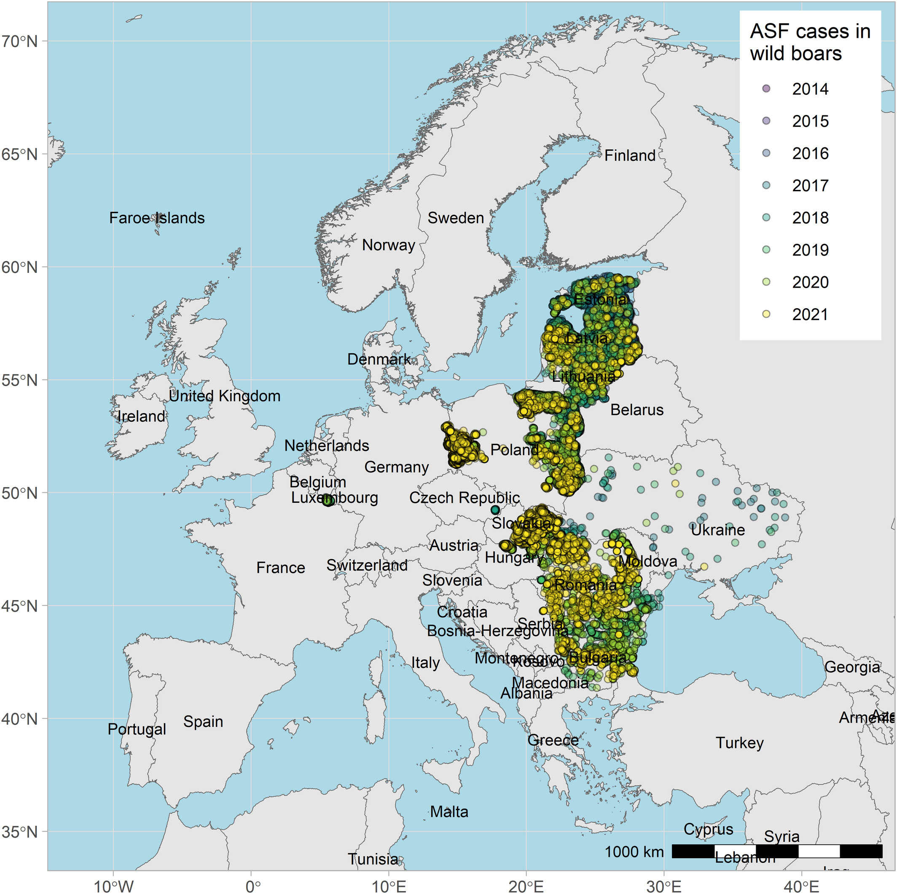{width="75%"}

::: {style="font-size:0.55em; color:#888; text-align:center; margin-top:0.2em"}
Source: EFSA (2022) — Epidemiological analyses of African swine fever in the European Union
:::
:::
:::::

::: {.notes}
Let me start with the **core tension** that motivated this thesis. 

African Swine Fever is one of the **most dangerous** livestock and **wildlife diseases** currently active in Europe. 

There is **no vaccine**, **case fatality** in wild boar approaches 100 percent, and the **virus persists in carcasses** for months. 

Since its introduction to the Caucasus in 2007, it has been **moving westward** steadily through wild boar populations.

What makes this particularly difficult from a management perspective is a **fundamental dilemma** that Hess identified in 1994.

**Under conditions of high virulence and direct-contact transmission** — which match ASF almost perfectly — a **good connectivity** with many wildlife corridors can lead to a **faster spread of the virus** and therefore to an **increased extinction risk** for populations rather than reduce it. 

This stands in **direct contrast** to the wildlife management practices for other mammals, such as the red deer.

While **high landscape connectivity** benefits red deer through **increased population exchange and genetic diversity**, for wild boar it **accelerates ASF spread**, driving increased extinction risk rather than population growth.

Every wildlife management intervention therefore **carries trade-offs** that must be evaluated carefully before implementation.

In this bachelor thesis i only focussed on the **connectivity of wild boar** and how its possible to **minimise their connectivity** to prevent ASF spreading.
:::

---

## What is missing

Existing connectivity models are **static**.

They answer: *where are the corridors?*

They cannot answer:

- *Which zones need surveillance if ASF is detected here today?*
- *What changes if we fence this road section?*
- *Does a new overpass help or redirect the problem?*

::: {.notes}
More specifically, the **goal** is to expand existing static connectivity models by developing an interactive QGIS plugin.

This plugin lets wildlife authorities **simulate an ASF outbreak** from any location in the canton, test the **effect of placing a barrier fence** across a pinchpoint, or **assess how a new wildlife crossing** would change movement corridors, all without programming knowledge.
:::

---

## Research objectives

**1 — Species-specific resistance surface**

Adapt the connectivity modelling framework from red deer (Fischer (2024), Urbina (2023)) to wild boar using GPS telemetry from Canton Aargau

**2 — Interactive QGIS planning tool**

Build a plugin that lets wildlife managers simulate ASF spread and test interventions

::: {.notes}
To build this plugin, an **empirical resistance surface** was first created based on GPS telemetry data from wild boars in the canton of Aargau.

The Plugin, then **takes this resistance surface** and lets the user run five different connectivity and risk analyses from a single interface, without programming knowledge.
:::

---

## Study area

::::: columns
::: {.column width="55%"}
- **Calibration:** Canton Aargau — GPS telemetry available
- **Transfer:** Canton Zürich — independent application area
- 25 m resolution · Swiss LV95
- Landscape: Swiss Plateau — forested areas cut by motorways, rail, agriculture and settlements
:::

::: {.column width="45%"}

::: {style="font-size:0.55em; color:#888; text-align:center; margin-top:0.2em"}
Study area extent — Canton Aargau with 1 km buffer, clipped at national border
:::
:::
:::::

::: {.notes}
Geographically, the tool was calibrated for the **Swiss Plateau** area. 

The GPS data was **collected in Canton Aargau**, and then transfered to the Canton of Zürich.

Both cantons **share a similar landscape** of a relatively flat plateau cut by motorways and several major rail lines, with forested ridges that are the main wildlife corridors.

The cantonal boundaries were **buffered** by one kilometre **to avoid edge effects** in focal window calculations near the study area margins.

The processing extent was **clipped at the national border** because the high-resolution Swiss federal geodata used for covariate derivation does not extend into Germany, and harmonising Swiss and German topographic datasets would have **exceeded the scope** of this thesis.
:::

---

## Resistance Surface Pipeline

::: {style="text-align:center"}
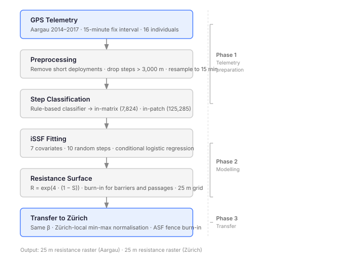{fig-align="center" width="60%"}
:::

::: {.notes}
Here you can see the **Processdiagram** of the Resistance Surface Pipeline.

It starts with **raw GPS data** from 16 animals in Aargau between 2014 and 2017 at a 15-minute fix interval. 

After **removing short deployments and dropping biologically implausible steps**  I classified each step as either in-matrix or in-patch using a three-rule hierarchical classifier. 

**Only the in-matrix** transit steps were used for fitting the iSSF, because those are the steps where **selection of movement corridors** actually happens. 

The iSSF produces **beta coefficients** that quantify which habitats animals prefer or avoid during transit. 

Those coefficients feed into the resistance surface through the **Keeley exponential transformation**.
:::

---

## Step classification

| Rule | Criterion | Steps | Share |
|------|----------------------------------------------------------------|------:|------:|
| 1 | Length > 250 m | 4,759 | 60.8 % |
| 2 | Length > 150 m **and** \|angle\| < π/4 | 2,748 | 35.1 % |
| 3 | ≥ 3 consecutive: length > 100 m **and** \|angle\| < π/4 | 317 | 4.1 % |
| — | Remaining (in-patch default) | 125,285 | — |

**Result: 7,824 in-matrix steps (5.9 %) · 14 individuals**

::: {.notes}
The classifier works **hierarchically**. 

Rule 1 catches **long, clearly directional** steps above 250 metres. 

Rule 2 catches **medium-distance** steps that are also **directionally consistent** — turning angle below π/4. 

Rule 3 catches **sustained runs** where no individual step is particularly long, but the **animal maintains direction over at least three consecutive steps**. 

Anything that fails all three rules is conservatively labelled **in-patch**.

The **thresholds are my own methodological decisions** informed by published wild boar movement data — Podgórski's speed data, Clontz's HMM results on the traveling state, and Benhamou's conceptual framework for in-patch versus in-matrix movement. None of those papers state these exact values as ready-to-use rules.

The result is that **94 percent** of steps are in-patch, which makes biological sense. Wild boar spend most of their time foraging and resting in a patch. The 6 percent that are in-matrix are the transit events the model is built on.
:::

---

## iSSF results

::::: columns
::: {.column width="55%"}

::: {style="font-size:0.55em; color:#888; text-align:center; margin-top:0.2em"}
iSSF coefficients with 95% confidence intervals — 7 retained covariates
:::
:::

::: {.column width="45%"}
- All 7 coefficients **positive**
- Positive = preferred during transit
- Forest density 50 m: tightest CI — most reliably estimated
- Railway: strong avoidance, wide CI (sparse in Aargau)
- Biologically realistic
:::
:::::

::: {.notes}
An iSSF (**integrated step-selection function**) is a **statistical model** that estimates which habitat features an animal selects for during movement by comparing observed GPS steps to random alternative steps drawn from the animal's own movement distribution.

I started with **14 candidate covariates** from the swissTLM3D dataset and the DHM25 elevation model. After a VIF (Variance Inflation Factor) check to flag collinearity, seven survived with all VIFs below 1.5.

All these covariates were **positive predictors** of transit movement, confirming that **wild boar prefer** denser forest cover and greater distance from roads, railways, and settlements during directed travel. This pattern is **biologically realistic and consistent** with the established movement ecology of the species.

The forest density at the 50 metre scale has the **highest beta coefficient** and **smallest standard error**. Which means its the **most reliably estimated effect**: immediate cover is the dominant driver of where a wild boar chooses to transit through the landscape.

**Railway avoidance** has also a very strong point estimate but the **widest confidence interval**, because Aargau has relatively **few railway lines** and the training data for that covariate is sparse. The **avoidance is real**, but we should not over-interpret the precise magnitude.

The **two movement kernel** terms were **both significant**, confirming that habitat selection and movement mechanics needed to be modelled jointly.
:::

---

## Resistance surface — Aargau

{width=100%}

::: {style="font-size:0.55em; color:#888; text-align:center; margin-top:0.1em"}
Habitat suitability (left) and resistance surface (right) for Canton Aargau · R range: 1–54.6 · white = absolute barrier (NoData)
:::

::: {.notes}
This is the **final Habitat Suitability and Resistance Surface** for the Canton Aargau.

They **reproduce the expected landscape structure**. **Forested ridges** appear as low-resistance green corridors. The **agricultural plain and urban areas push** resistance up toward the maximum. 

**Motorways and large lakes** appear as white NoData — absolute barriers.
:::

---

## Transfer to Zürich

{width=100%}

::: {style="font-size:0.55em; color:#888; text-align:center; margin-top:0.1em"}
Habitat suitability (left) and resistance surface (right) for Canton Zürich · Aargau β reused · Zürich-local normalisation · permanent ASF fences burned in as absolute barriers
:::

::: {.notes}
For the transfer to Zürich, I **reused the Aargau beta coefficients and z-standardisation** parameters unchanged. 

This **keeps the coefficients interpretable** — a unit change in a covariate still means a unit change on the Aargau scale. 

Only the **final min-max normalisation** of the linear predictor is computed on the **Zürich-specific range**, so that the full resistance scale is used within Zürich rather than being compressed.

One additional element unique to Zürich are the **permanent ASF prevention fences** from the cantonal veterinary authority. Those are **burned in as absolute barriers** alongside fenced motorways and large lakes. 

At the end the **Wildlife passages** override everything.
:::

---

## QGIS Plugin workflow

::: {style="text-align:center"}
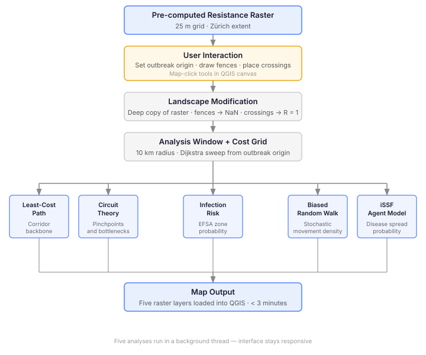{fig-align="center" width="50%"}
:::

::: {.notes}
This is the **Processdiagram** of the QGIS Plugin workflow.

First the **resistance surface has to be loaded** in a QGIS session.

Then the **user picks an outbreak point** on the map with a single click. They can **optionally draw fence segments or place new wildlife overpasses**.

Those **modifications are applied to a copy of the raster in memory**, so the original file is never touched. 

Then they **select which of the five analyses** to run and press Run.

Everything happens in a **background thread** so QGIS stays responsive. All outputs appear as styled map layers within about three minutes for a typical 10-kilometre analysis window.

The **five modules are complementary**: LCP gives the backbone corridor, infection risk maps the EFSA (European Food Safety Authority) zones, Circuitscape identifies bottlenecks, BCRW provides a stochastic cross-check, and the IBMM adds an epidemiological layer calibrated to the ASF infectious period.
:::

---

## Least-cost path

::::: columns
::: {.column width="50%"}

::: {style="font-size:0.55em; color:#888; text-align:center; margin-top:0.2em"}
Baseline — outbreak origin north of Winterthur
:::
:::
::: {.column width="50%"}

::: {style="font-size:0.55em; color:#888; text-align:center; margin-top:0.2em"}
After intervention — fence across main corridor, new overpass added
:::
:::
:::::

::: {.notes}
**Presentation**

The least-cost path **traces the cheapest route through the resistance surface** from the outbreak origin to the nearest habitat clusters. 

On the left is the baseline. The darker the blue, the more destination clusters share that segment, which marks the main dispersal backbone. 

On the right, a fence segment was placed across the main corridor and a new overpass added to the south of the outbreak origin. 

The **backbone reroutes** immediately through the overpass and shifts northward. 

This is the most intuitive module and gives an **important overview** of the major wildlife corridors.

The **main limitation** is that if there are multiple routes which are nearly equally cheap, the module only ever returns one of them and the existence of a viable alternative corridor stays invisible.

The method also assumes that the animal has **perfect knowledge** over the entire landscape and only uses the theoretically best route.

**For supervisors**

The algorithm is Dijkstra on an 8-connected pixel grid, with diagonal moves penalised by a factor of the square root of 2 to avoid underestimating diagonal cost. 

Habitat destinations are either supplied by the user as a polygon layer or auto-detected by thresholding the resistance raster. 

Shared segments accumulate strength proportional to the number and distance to destination clusters they serve. 

The method assumes the animal has complete knowledge of the cost surface across the entire canton, which is biologically unrealistic but is a standard and accepted simplification in connectivity modelling. 
:::

---

## Circuit theory

::::: columns
::: {.column width="50%"}
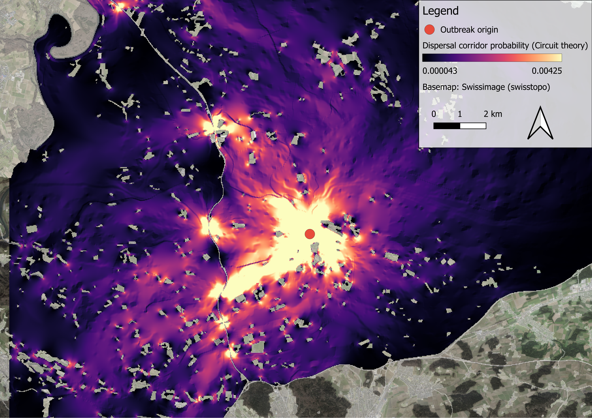

::: {style="font-size:0.55em; color:#888; text-align:center; margin-top:0.2em"}
Baseline — bright cells mark structural pinchpoints
:::
:::
::: {.column width="50%"}
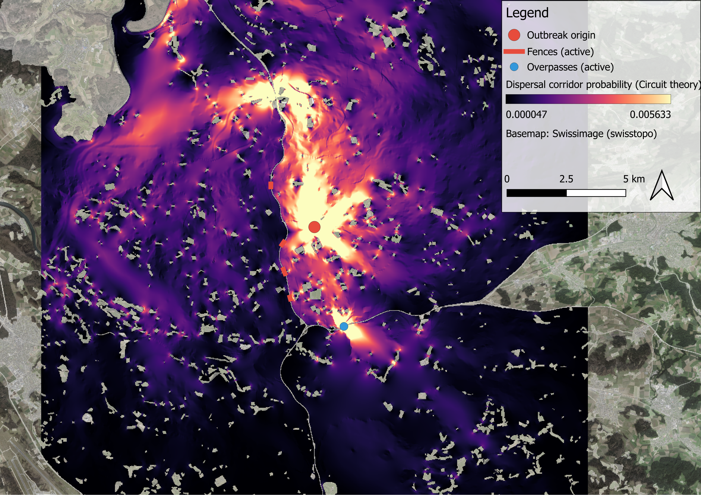

::: {style="font-size:0.55em; color:#888; text-align:center; margin-top:0.2em"}
After intervention — current redistributes away from fenced segment
:::
:::
:::::

::: {.notes}
**Presentation**

Circuit theory **injects current from the outbreak origin** and the brightness of each cell shows how much current passes through it. 

The **brightest cells are the pinchpoints**. The locations where movement is most concentrated and where a fence would have the greatest effect. 

On the right, **after placing the fence**, current can no longer flow through the main pinchpoint. It **redistributes into secondary corridors** and through the overpass. 

The bright **branches shift**, confirming that the fence has structurally changed the animals movement.

Compared to the least-cost-path analysis, the circuit theory method identifies not only the single theoretically optimal corridor but also **all parallel corridors**.

**For supervisors**

The preferred solver is the official Julia package Circuitscape.jl, called as an external subprocess. A scipy Laplacian solver written in Python serves as a fallback when Julia is not available. Both produce equivalent results. 

The mathematical equivalence between circuit theory and the expected number of visits by a random walker means that pinchpoints correspond to where a randomly dispersing animal would concentrate its movement, giving the result a direct biological interpretation. 

The key limitation is that the method aggregates resistance across parallel and series paths in the resistor network, and this can make a route through the edge of a settlement register as a dominant pinchpoint if it is electrically cheaper than the forested alternative, even though a wild boar would never use it in practice.

A wild boar has bigger global knowledge than current.
:::

---

## Infection risk

::::: columns
::: {.column width="50%"}
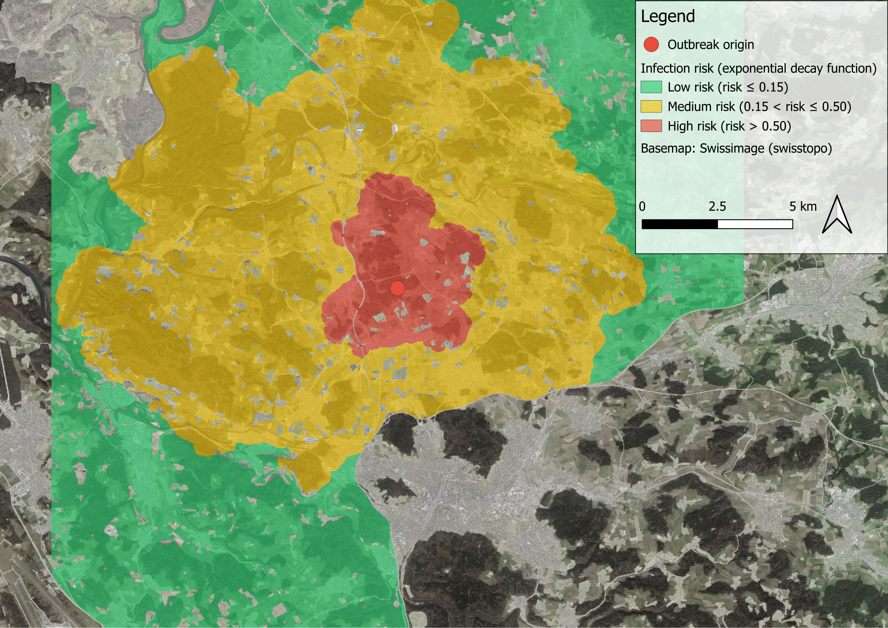

::: {style="font-size:0.55em; color:#888; text-align:center; margin-top:0.2em"}
Baseline — red: 3 km protection zone · yellow: 10 km surveillance zone
:::
:::
::: {.column width="50%"}
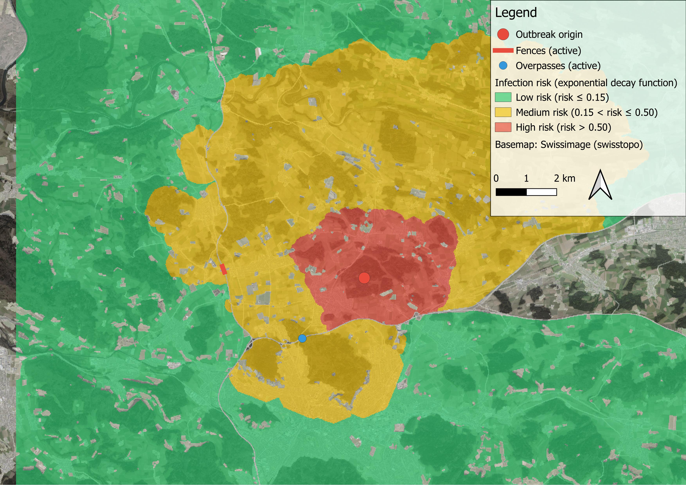

::: {style="font-size:0.55em; color:#888; text-align:center; margin-top:0.2em"}
After intervention — risk zone contracts on fenced side, extends through overpass
:::
:::
:::::

::: {.notes}
**Presentation**

The infection risk module **converts cost-distance from the outbreak origin into a probability surface** using an exponential decay function. 

Red is the **high-risk zone** corresponding to the EFSA 3-kilometre protection radius. Yellow is the 10-kilometre **surveillance zone**. Green marks low risk beyond that. 

The zones are **adjusted to the landscape resistance** which makes the actual spread radius of the virus more realistic. 

The virus will extend **further through forested corridors** and contract toward Settlements where resistance is high. 

On the right, after placing the fence, the red zone shrinks on the fenced side and the **high-risk zone retracts in that direction**. The risk does not disappear but is redirected through the new overpass corridor.

This method gives authorities a **directly readable risk surface** aligned with regulatory thresholds.

**For supervisors**

The decay function is risk = exp(minus d divided by D_cost), where D_cost rescales the published 4-kilometre mean wild boar dispersal distance into cost units using the pixel size and the median resistance of the analysis window. 

Because the median resistance shifts whenever the user changes the outbreak origin or adds a landscape modification, the same nominal risk value can correspond to a different real-world distance between scenario runs, making direct numerical comparison between runs less straightforward than it appears. 

The strength of the module is that it gives veterinary authorities an output they can act on immediately, because it speaks the language of the EFSA operational zones that already govern their response protocols.
:::

---

## Biased correlated random walk

::::: columns
::: {.column width="50%"}
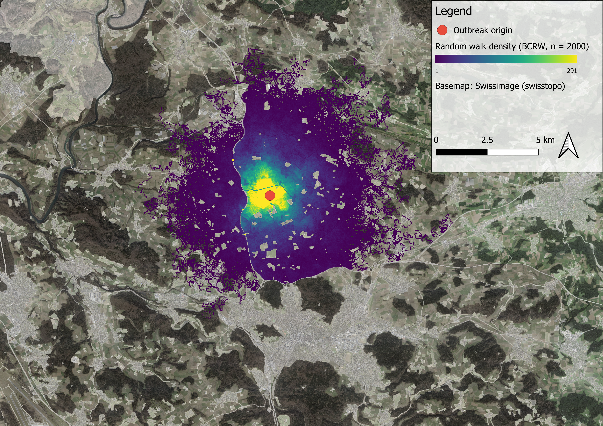

::: {style="font-size:0.55em; color:#888; text-align:center; margin-top:0.2em"}
Baseline — brightness shows visit density of 2,000 simulated walkers
:::
:::
::: {.column width="50%"}
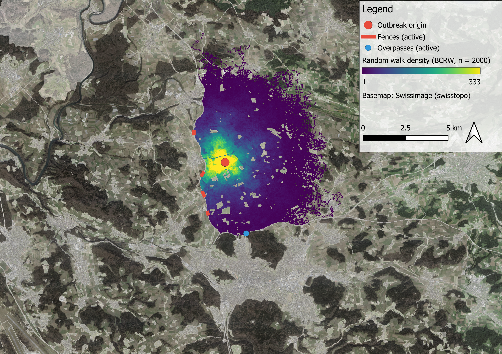

::: {style="font-size:0.55em; color:#888; text-align:center; margin-top:0.2em"}
After intervention — density blocked by motorway fence
:::
:::
:::::

::: {.notes}
**Presentation**

The biased correlated random walk **releases 2,000 simulated animals** from the outbreak origin. 

Each **walker selects its next step based on the resistance of its neighbouring cells** and a directional persistence term that keeps it moving in roughly the same direction. 

The **brightness of each cell shows how many walkers visited it**. 

On the left, the **density concentrates in a core around the origin** and fans out along the forested ridges. 

On the right, after the fence intervention, the density is completly blocked by the motorway. 

**For supervisors**

The mathematical connection between the biased correlated random walk and circuit theory is established by Panzacchi et al. (2016), who showed that the BCRW density surface converges to the circuit-theory current density **as the number of walkers and the temperature parameter of the cost weighting approach their respective limits**. 

The result converges toward the circuit-theory pinchpoint pattern, which is expected because the two methods are theoretically related.

In the plugin, the cost weight follows a Boltzmann distribution over the resistance values of candidate endpoints, and the directional persistence follows a von Mises distribution with parameters taken from the iSSF fitting. 

One known limitation is that the stochastic component can occasionally override the landscape pull, sending a walker into open or settled terrain that the cost surface would otherwise disfavour. 

A related limitation is that the method can fail to register small localised features such as a single wildlife overpass, because a walker only reacts to resistance immediately around its current position and may simply never visit the overpass cell.
:::

---

## iSSF agent model

::::: columns
::: {.column width="50%"}
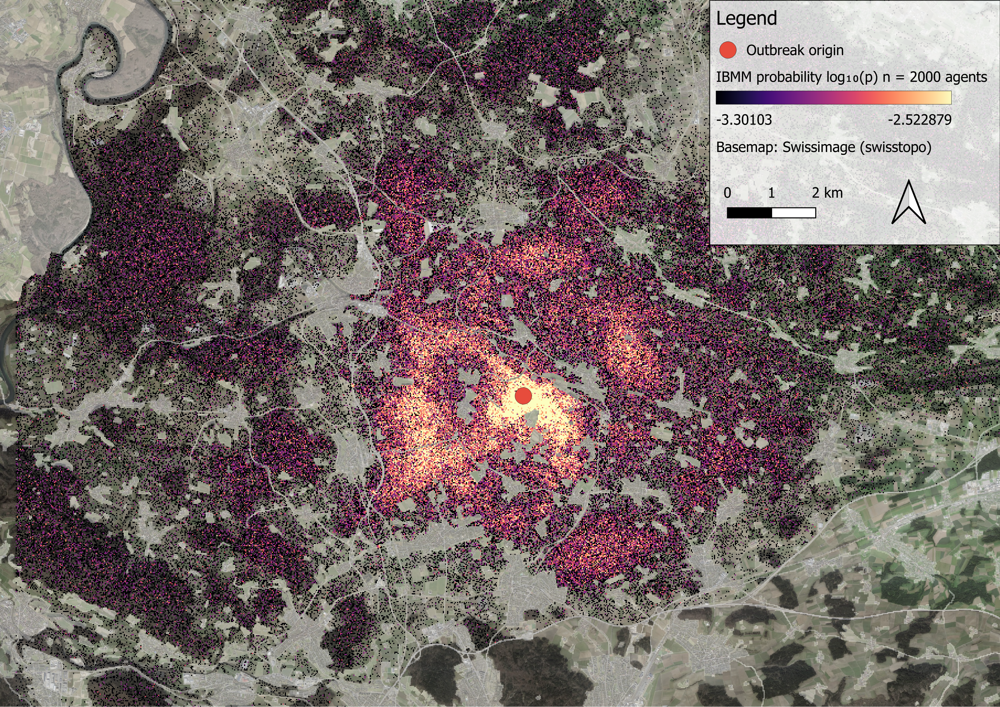

::: {style="font-size:0.55em; color:#888; text-align:center; margin-top:0.2em"}
Baseline — contamination probability from 2,000 infected agents over the ASF infectious period
:::
:::
::: {.column width="50%"}
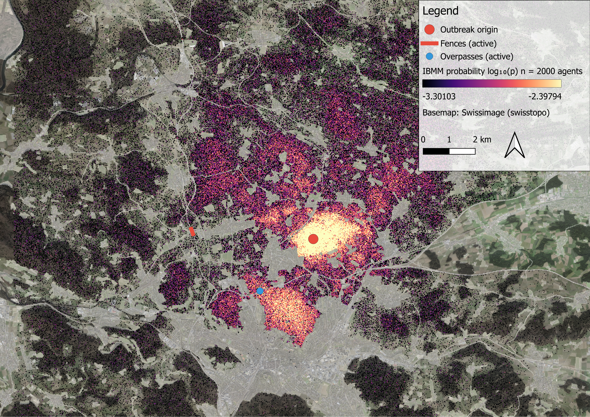

::: {style="font-size:0.55em; color:#888; text-align:center; margin-top:0.2em"}
After intervention — limited response to fence intervention
:::
:::
:::::

::: {.notes}
**Presentation**

The iSSF agent model **simulates 2,000 infected wild boar** from the outbreak origin. 

Each agent **moves for a stochastically drawn infectious period** calibrated to virological data on ASF in European wild boar. 

At each step it **samples candidate endpoints from the movement kernel** and **selects among them based on habitat suitability**. 

The **fraction of agents visiting each cell** gives the contamination probability. 

This is the only module that **combines movement behaviour with the actual duration of infectiousness**, so it shows disease reach rather than movement capacity alone. 

The fence scenario shows limited change compared to the other modules, which is a strong limitation of the method and shows that there is no single best method to model wild boar connectivity and ASF spreading but a combination of different methods provide different views and best information for real management decisions.

The fence scenario shows little response in the IBMM output compared to the other four modules. 

This limitation illustrates that there is **no single best method** in this case. Each module captures a different aspect of the problem, and it is the combination of all five that gives the most complete basis for a management decision.

**For supervisors**

The limited response to the fence is a known implementation artefact. Agents select their next step by scoring candidate endpoints drawn from the movement kernel by habitat suitability. 

The check is purely on the destination cell: the model does not test whether the straight line from the current position to that endpoint crosses an absolute barrier such as a motorway or a NaN-encoded fence. 

An agent can therefore appear on the wrong side of a barrier in a single step. Fixing this would require a line-of-sight check for every candidate endpoint of every agent at every step, which is computationally expensive and was beyond the scope of this thesis. 

The IBMM is therefore best used for assessing disease reach in open corridors rather than for evaluating the effect of hard barriers. 

For fence placement decisions, circuit theory and the least-cost path are the appropriate modules. 

The broader lesson is that no single method captures the full picture. The combination of all five gives a wildlife manager the most complete basis for a decision.
:::

---

## Key limitations

- No Zürich telemetry → no quantitative validation
- 10-year gap between telemetry (2014–17) and landscape data (2026)
- Keeley C = 4 from red deer, no wild-boar-specific value
- Edge Effects on national border

::: {.notes}
Now to the **Key limitations**.

The most significant limitation is the **absence of GPS telemetry** from Canton Zürich. Without independent movement data from the transfer area, **model quality cannot be validated beyond visual plausibility**, which leaves the practical reliability of the Zürich surface uncertain.

A **ten-year gap** separates the telemetry data collected between 2014 and 2017 from the landscape covariates derived from the 2026 swissTLM3D edition. Infrastructure changes and land cover transitions that occurred in that period are not reflected in the behavioural calibration, and their net effect on the resistance surface was not assessed.

The **Keeley constant C = 4** was adopted from Fischer (2024), where it was **calibrated for red deer**. Because **wild boar are a more generalist species** that tolerates a wider range of habitat types, their perceived **movement cost may rise less steeply** with declining suitability than the current parameterisation assumes. No species-specific value exists in the literature, making this a pragmatic rather than empirically derived choice.

Finally, the **national boundary introduces edge effects** along the northern study area margin. Wild boar do not respond to administrative borders, and the **absence of German geodata** means that corridors crossing into Baden-Württemberg are truncated at the national boundary rather than modelled continuously.
:::

---

## Conclusions and outlook

::::: {.columns style="font-size:0.82em"}
::: {.column width="55%"}
**Deliverables**

- Wild-boar-specific resistance surface for the Swiss Plateau
- Interactive QGIS plugin with 5 complementary analyses

**The tool is ready for pilot use**
:::

::: {.column width="45%"}
**Priority next steps**

1. GPS telemetry from Zürich wild boar — validation
2. Additional or optimized spatial Covariates
3. Day / night movement distinction
4. Cross-border data
5. Adjusted Keeley constant C = 4
:::
:::::

::: {.notes}
To summarise: the **tool is ready for pilot use**.

The **resistance surface is calibrated** specifically for wild boar in the Swiss Plateau. 

The **QGIS plugin works** as an interactive wildboar connectivity and ASF scenario planning tool that integrates five complementary connectivity models in a single accessible interface.

The **most important next step** is now to get GPS tracking data from wild boar in Zürich and run a formal validation. 

Everything else on the list is valuable, but none of it matters as much as knowing whether the model actually captures how Zürich wild boar move.
:::

---

## Thank you

::: {style="text-align:center; margin-top:2em"}
**Lukas Buchmann**

Bachelor Thesis · Applied Digital Life Science · ZHAW · July 2026

Supervisors: Nils Ratnaweera · Benjamin Sigrist
:::

::: {style="text-align:center; margin-top:2.5em; font-size:0.85em; color:#555"}
*Happy to take questions.*